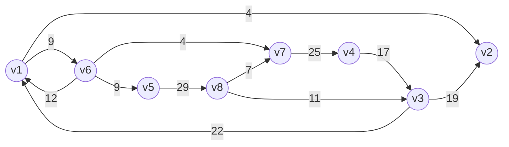

### 1.1图的定义

上课讲过一大堆这里不再赘述，直接学习代码实现。

### 1.2图的存储

例图展示：



`设n个点，m条边`

上图的数据（按照 起点-终点-权值）：

```plaintext
8 12
5 8 29
6 1 12
8 3 11
1 2 4
3 1 22
4 3 17
7 4 25
6 5 9
8 7 7
1 6 9
3 2 19
6 7 4
```

#### 邻接矩阵

* 遍历效率低、不能存重边、初始化效率低`初始化O(n^2)时间，建图O(m)时间`、空间开销大`O(n^2)`
* 对于稀疏图来说大部分是INF，空间利用效率也不高

#### 前向星

前向星涉及排序，所以其时间复杂度和排序算法有关，一般情况下时间复杂度为`O(mlog m)`，空间上需要两个数组（记录边的边数组、记录各点在边数组中起始位置的head数组），空间复杂度为`O(m+n)`

<u>优点：在点特别多时可以存储重边</u>

<u>缺点：不能直接判断任意两个点之间是否有边。排序和初始化数组费时间。</u>


需要的数据结构如下：

```cpp
int head[maxn];
struct NODE{
    int from;	// 起点
    int to;		// 终点
    int w;		// 权值
};
NODE edge[maxm];
```

NODE用来存储每条边的信息，边按照输入读取后再排序，排序之后使用`head[maxn]`来储存各个点的在`edge[maxm]`里的起始位置。

排序方式：

```cpp
bool cmp(NODE a, NODE b){
    if(a.from==b.from&&a.to==b.to)
        return a.w<b.w;
    if(a.from==b.from)
        return a.to<b.to;
    return a.from<b.from;
}
```


完整代码：

```cpp
#include<bits/stdc++.h>
using namespace std;
const long long maxn = 1e5 + 50, maxm = 1e7 + 50;


struct NODE {
	int from, to, w;
}edge[maxm];

int head[maxn];

bool cmp(NODE a, NODE b) {
	if (a.from == b.from && a.to == b.to)
		return a.w < b.w;
	if (a.from == b.from)
		return a.to < b.to;
	return a.from < b.from;
}

int main() {
	int n, m;
	cin >> n >> m;
	
	// 读入数据
	for (int i = 0;i < m;i++)
		cin >> edge[i].from >> edge[i].to >> edge[i].w;
	
	// 排序
	sort(edge, edge + m, cmp);

	// 初始化head
	memset(head, -1, sizeof(head));

	// 制成点位数组
	head[edge[0].from] = 0;	// 初始化
	// edge数组中起点为点i的在数组里的第一条边在下标head[i]处
	for (int i = 1;i < m;i++)
		if (edge[i].from != edge[i - 1].from)
			// 表明是新的起始点
			head[edge[i].from] = i;

	// 遍历输出各边信息（按点位输出）
	for (int i = 1;i <= n;i++) {
		cout << "以点v" << i << "为起点的边：" << endl;
		for (int j = head[i];j < m && edge[j].from == i;j++) {
			cout << "v" << edge[j].from << "-->v" << edge[j].to << " 权值为：" << edge[j].w << " 该边在数组edge中的序号为" << j << endl;
		}
		cout << endl;
	}

	return 0;
}

// Output：
/*
以点v1为起点的边：
v1-->v2 权值为：4 该边在数组edge中的序号为0
v1-->v6 权值为：9 该边在数组edge中的序号为1

以点v2为起点的边：

以点v3为起点的边：
v3-->v1 权值为：22 该边在数组edge中的序号为2
v3-->v2 权值为：19 该边在数组edge中的序号为3

以点v4为起点的边：
v4-->v3 权值为：17 该边在数组edge中的序号为4

以点v5为起点的边：
v5-->v8 权值为：29 该边在数组edge中的序号为5

以点v6为起点的边：
v6-->v1 权值为：12 该边在数组edge中的序号为6
v6-->v5 权值为：9 该边在数组edge中的序号为7
v6-->v7 权值为：4 该边在数组edge中的序号为8

以点v7为起点的边：
v7-->v4 权值为：25 该边在数组edge中的序号为9

以点v8为起点的边：
v8-->v3 权值为：11 该边在数组edge中的序号为10
v8-->v7 权值为：7 该边在数组edge中的序号为11

*/
```


#### 邻接表

图的一种链式存储结构，把图G中所有邻接于v~i~的顶点链接成为一个v~i~的单链表。

三种实现方法：

##### 1. 动态建表

动态建表的时间效率是`O(m)`，空间效率是`O(m)`，主要的时间损耗在于不断地申请新空间，且判断任意两个点之间是否有边相连的效率也低（需要搜索各个点的单链表）(感觉还好？)。


数据结构：

```cpp
struct EdgeNode {
	int to;		// 终点
	int w;		// 权值
	EdgeNode* next;		// 下一边的指针
};

struct VNode {
	int from;	// 起点（这个数据结构中from没有传值，我们以遍历Adjlist时的遍历时序用于指定起点）
	EdgeNode* first;	// 邻接表的头指针
};
```

完整代码：

```cpp
#include<bits/stdc++.h>
using namespace std;
const long long maxn = 1e5 + 50, maxm = 1e7 + 50;

struct EdgeNode {
	int to;		// 终点
	int w;		// 权值
	EdgeNode* next;		// 下一边的指针
};

struct VNode {
	int from;	// 起点（这个数据结构中from没有传值，我们以遍历Adjlist时的遍历时序用于指定起点）
	EdgeNode* first;	// 邻接表的头指针
};

VNode Adjlist[maxn];	// 全图

int main() {
	int n, m;
	cin >> n >> m;
	
	// 读入数据
	for (int i = 0;i < m;i++) {
		int fi, ti, wi;
		cin >> fi >> ti >> wi;
		// 创建一个新的边结构数据
		EdgeNode* p = new EdgeNode();
		// 给该数据传值
		p->to = ti;
		p->w = wi;
        
		// 该新边的next指针指向上一个链接到起点为fi的单链表中的起点
        /*
        （相当于在前面插入，这点可以观察遍历输出部分发现，比如先读入的v1-->v2后读入的v1-->v6，但在储存时我们将后来的v1-->v6插入在了v1-->v2前面）
        */
		p->next = Adjlist[fi].first;

		// 将起点为fi的单链表的指针更新为这个新传入边的地址
		Adjlist[fi].first = p;
	}

	// 遍历
	for (int i = 1;i <= n;i++) {
		cout << "点v" << i << "为起点的边：" << endl;
		int ind = 0;
		for (EdgeNode* k = Adjlist[i].first;k != NULL;k = k->next) {
			// 指针遍历该链表至结束
			cout << "v" << i << " -->v" << k->to << " 权值为：" << k->w << " 该边记录在点v" << i << "的单链表的第" << ind++ << "个" << endl;
		}
		cout << "点v" << i << "为的度数为：" << ind << endl;
		cout << endl;
	}

	return 0;
}

// Output:
/*
点v1为起点的边：
v1 -->v6 权值为：9 该边记录在点v1的单链表的第0个
v1 -->v2 权值为：4 该边记录在点v1的单链表的第1个
点v1为的度数为：2

点v2为起点的边：
点v2为的度数为：0

点v3为起点的边：
v3 -->v2 权值为：19 该边记录在点v3的单链表的第0个
v3 -->v1 权值为：22 该边记录在点v3的单链表的第1个
点v3为的度数为：2

点v4为起点的边：
v4 -->v3 权值为：17 该边记录在点v4的单链表的第0个
点v4为的度数为：1

点v5为起点的边：
v5 -->v8 权值为：29 该边记录在点v5的单链表的第0个
点v5为的度数为：1

点v6为起点的边：
v6 -->v7 权值为：4 该边记录在点v6的单链表的第0个
v6 -->v5 权值为：9 该边记录在点v6的单链表的第1个
v6 -->v1 权值为：12 该边记录在点v6的单链表的第2个
点v6为的度数为：3

点v7为起点的边：
v7 -->v4 权值为：25 该边记录在点v7的单链表的第0个
点v7为的度数为：1

点v8为起点的边：
v8 -->v7 权值为：7 该边记录在点v8的单链表的第0个
v8 -->v3 权值为：11 该边记录在点v8的单链表的第1个
点v8为的度数为：2
*/
```

注意到，无向图中各点的度正好是各点的单链表中链节的个数，也就是上述代码中`ind`最后的结果值，而之余有向图，`ind`就是对应顶点的出度。

若要求得入度则必须遍历整个邻接表或者建立一个逆链接表（以v~i~边为终边的链接表）。

注意：一个图 的邻接表不是唯一的，其具体的邻接次序与边的输入次序有关。


##### 2. vector模拟链表实现

vector模拟链表的实现方式与前一种区别不大（前插入和后插入的区别？反正基本没有质变）

不过这种方式代码量少，不容易出错，也不用指针指来指去。也不需要我们来考虑内存的申请和释放。比较友好（qwq）

需要数据结构：

```cpp
struct EdgeNode {
	int to;		// 终点
	int w;		// 权值
};
vector<EdgeNode>mp[maxn];
```


完整代码：

```cpp
#include<bits/stdc++.h>
using namespace std;
const long long maxn = 1e5 + 50, maxm = 1e7 + 50;

struct EdgeNode {
	int to;		// 终点
	int w;		// 权值
};
vector<EdgeNode>mp[maxn];
int main() {
	int n, m;
	cin >> n >> m;

	// 读入数据
	for (int i = 0;i < m;i++) {
		EdgeNode e;
		int fi, ti, wi;
		cin >> fi >> ti >> wi;
		
		e.to = ti;
		e.w = wi;
		mp[fi].push_back(e);
	}

	// 遍历
	for (int i = 1;i <= n;i++) {
		cout << "点v" << i << "为起点的边：" << endl;
		
		vector<EdgeNode>::iterator it = mp[i].begin();
		int ind = 0;
		for (;it != mp[i].end();it++) {
			cout << "v" << i << "-->v" << (*it).to << " 权值为：" << (*it).w << " 该边在所有以点v" << i << "为起点的边中序号为" << ind++ << endl;
		}
		cout << "点v" << i << "的度数为：" << ind << endl;
		cout << endl;
	}
	

	return 0;
}
// Output:
/*
点v1为起点的边：
v1-->v2 权值为：4 该边在所有以点v1为起点的边中序号为0
v1-->v6 权值为：9 该边在所有以点v1为起点的边中序号为1
点v1的度数为：2

点v2为起点的边：
点v2的度数为：0

点v3为起点的边：
v3-->v1 权值为：22 该边在所有以点v3为起点的边中序号为0
v3-->v2 权值为：19 该边在所有以点v3为起点的边中序号为1
点v3的度数为：2

点v4为起点的边：
v4-->v3 权值为：17 该边在所有以点v4为起点的边中序号为0
点v4的度数为：1

点v5为起点的边：
v5-->v8 权值为：29 该边在所有以点v5为起点的边中序号为0
点v5的度数为：1

点v6为起点的边：
v6-->v1 权值为：12 该边在所有以点v6为起点的边中序号为0
v6-->v5 权值为：9 该边在所有以点v6为起点的边中序号为1
v6-->v7 权值为：4 该边在所有以点v6为起点的边中序号为2
点v6的度数为：3

点v7为起点的边：
v7-->v4 权值为：25 该边在所有以点v7为起点的边中序号为0
点v7的度数为：1

点v8为起点的边：
v8-->v3 权值为：11 该边在所有以点v8为起点的边中序号为0
v8-->v7 权值为：7 该边在所有以点v8为起点的边中序号为1
点v8的度数为：2

*/
```

##### 3. ★★★静态建表（链式前向星）

邻接表的静态建表存储图的方式也称链式前向星，基于前向星，以提高构造效率为目的设计的存储方式，最终形成的数据是一个变形的邻接表。

链式前向星采用数组模拟链表的方式实现邻接表的功能，使用很少的额外空间，<u>是目前建图和遍历效率最高的存储方式。</u>


数据结构：

```cpp
struct EdgeNode {
	int to;		// 终点
	int w;		// 权值
	int next;	// 下一位置
};
EdgeNode Edge[maxm];
int head[maxn];
```

数组模拟链表的主要方式是记录下一节点的位置在整个数组的位置坐标，并将这个标志坐标存在一个head数组中，遍历时根据输入的边的信息更新head对应的更新位置，并将原来的节点信息存在此时读入的边的next数据中。

存值方式：

```cpp
// 读入数据
for (int i = 0;i < m;i++) {
    int fi, ti, wi;
    cin >> fi >> ti >> wi;
    Edge[i].to = ti;
    Edge[i].w = wi;

    Edge[i].next = head[fi];
    head[fi] = i;
}
```


完整代码：

```cpp
#include<bits/stdc++.h>
using namespace std;
const long long maxn = 1e5 + 50, maxm = 1e7 + 50;

struct EdgeNode {
	int to;		// 终点
	int w;		// 权值
	int next;	// 下一位置
};
EdgeNode Edge[maxm];
int head[maxn];

int main() {
	int n, m;
	cin >> n >> m;

	// 初始化head
	memset(head, -1, sizeof(head));
	
	// 读入数据
	for (int i = 0;i < m;i++) {
		int fi, ti, wi;
		cin >> fi >> ti >> wi;
		Edge[i].to = ti;
		Edge[i].w = wi;
		
		Edge[i].next = head[fi];
		head[fi] = i;
	}

	
	// 遍历
	for (int i = 1;i <= n;i++) {
		cout << "点v" << i << "为起点的边：" << endl;
		
		int ind = 0;
		for (int j = head[i];j != -1;j = Edge[j].next) {
			cout << "v" << i << "-->v" << Edge[j].to << " 权值为：" << Edge[j].w << " 该边在所有以点v" << i << "为起点的边中序号为" << ind++ << endl;
		}
		cout << "点v" << i << "的度数为：" << ind << endl;
		cout << endl;
	}

	// 展示一下head数组里的内容：
	cout << "----------head数组里的内容----------" << endl;
	for (int i = 1;i <= n;i++)
		cout << "head[" << i << "]=" << head[i] << endl;
	cout << endl;

	return 0;
}

// Output:
/*
点v1为起点的边：
v1-->v6 权值为：9 该边在所有以点v1为起点的边中序号为0
v1-->v2 权值为：4 该边在所有以点v1为起点的边中序号为1
点v1的度数为：2

点v2为起点的边：
点v2的度数为：0

点v3为起点的边：
v3-->v2 权值为：19 该边在所有以点v3为起点的边中序号为0
v3-->v1 权值为：22 该边在所有以点v3为起点的边中序号为1
点v3的度数为：2

点v4为起点的边：
v4-->v3 权值为：17 该边在所有以点v4为起点的边中序号为0
点v4的度数为：1

点v5为起点的边：
v5-->v8 权值为：29 该边在所有以点v5为起点的边中序号为0
点v5的度数为：1

点v6为起点的边：
v6-->v7 权值为：4 该边在所有以点v6为起点的边中序号为0
v6-->v5 权值为：9 该边在所有以点v6为起点的边中序号为1
v6-->v1 权值为：12 该边在所有以点v6为起点的边中序号为2
点v6的度数为：3

点v7为起点的边：
v7-->v4 权值为：25 该边在所有以点v7为起点的边中序号为0
点v7的度数为：1

点v8为起点的边：
v8-->v7 权值为：7 该边在所有以点v8为起点的边中序号为0
v8-->v3 权值为：11 该边在所有以点v8为起点的边中序号为1
点v8的度数为：2

----------head数组里的内容----------
head[1]=9
head[2]=-1
head[3]=10
head[4]=5
head[5]=0
head[6]=11
head[7]=6
head[8]=8
*/
```

除了不能直接用起点终点确定是否有边外，链式前向星几乎是完美的。

### 1.3图的遍历

从v~0~出发系统的访问图G中所有的顶点，每个顶点访问一次，称为图的遍历。

#### 深度优先遍历

从一个节点开始，按照连接，访问到最后一个没有被访问的顶点，然后再从顺序上没有被访问的分路继续访问到最深处，如此循环至全部被访问。

深度优先样例代码：

```cpp
// 用一个布尔型数组来标记是否被遍历到
bool s[maxn] = { 0 };

void dfs(int x) {
	// 传入节点名x
	s[x] = true;	// 标记被访问
	cout << x << " ";
	for (int i = head[x];i != -1;i = Edge[i].next) {
		// 找到该节点为起点的头位置，然后按顺序去遍历下一个和节点x相连的节点位置，并标记访问
		if (!s[Edge[i].to])
			// 如果当前边的终点未被访问，我们就去访问它
			dfs(Edge[i].to);
		
		// 当前边的终点如果已被访问，我们就访问和节点x的下一条边，即给i赋值为Edge[i].next
	}
}
```


完整代码：

```cpp
#include<bits/stdc++.h>
using namespace std;
const long long maxn = 1e5 + 50, maxm = 1e7 + 50;

struct EdgeNode {
	int to;		// 终点
	int w;		// 权值
	int next;	// 下一位置
};
EdgeNode Edge[maxm];
int head[maxn];

// 用一个布尔型数组来标记是否被遍历到
bool s[maxn] = { 0 };

void dfs(int x) {
	// 传入节点名x
	s[x] = true;	// 标记被访问
	cout << x << " ";	// 输出被标记的点（观察顺序）
	for (int i = head[x];i != -1;i = Edge[i].next) {
		// 找到该节点为起点的头位置，然后按顺序去遍历下一个和节点x相连的节点位置，并标记访问
		if (!s[Edge[i].to])
			// 如果当前边的终点未被访问，我们就去访问它
			dfs(Edge[i].to);
		
		// 当前边的终点如果已被访问，我们就访问和节点x的下一条边，即给i赋值为Edge[i].next
	}
}

int main() {
	int n, m;
	cin >> n >> m;

	// 初始化head
	memset(head, -1, sizeof(head));
	
	// 读入数据
	for (int i = 0;i < m;i++) {
		int fi, ti, wi;
		cin >> fi >> ti >> wi;
		Edge[i].to = ti;
		Edge[i].w = wi;
		
		Edge[i].next = head[fi];
		head[fi] = i;
	}

	// 深度优先访问，从顶点1开始（没有点0啦）
	dfs(1);
	// Output:
	/*
		1 6 7 4 3 2 5 8
	*/
	// 可以结合图去观察这个顺序，便于理解深度优先搜索


	return 0;
}

```

注意：这里还是使用强推的<u>链式前向星</u>数据结构来储存图，因为边在读入的时候是前插入，所以后读入的边会先被遍历。


#### 广度优先遍历

广度优先就是先访问顶点v~0~的所有边的终点，然后再访问第一条边往下延续的未被访问的顶点（第一条边往下没有就第二条边...如此搜索）

广度优先用到了队列来记录遍历某顶点广度时，遍历的这个终点的下一点(next)是否被遍历，如果未被遍历则标记入队，等待当前顶点按照广度优先被遍历完终点后从该队列中获得下一轮被遍历的点。


广度优先样例代码：

（啊啊啊突然发现拼错单词了，其实队列的单词是queue，不过在c++里引用了stl容器还用queue命名不太好吧(虽然没影响)...不管了！算了，还是改过来吧QAQ）

```cpp
// 用一个布尔型数组来标记是否被遍历到
bool s[maxn] = { 0 };

void bfs(int x) {
	int queue[maxn];
	int iq = 0;		// 遍历以x为顶点的起始状态时，队列是空的
	queue[iq++] = x;	// 给当前队列添加被访问的这个顶点x
	
	for (int i = 0;i < iq;i++) {
		
		// 这个队列按序输出可以反应搜索顺序
		cout << queue[i] << " ";
		
		// 按照广度优先构造顺序队列(入队的都算作被访问了，下次执行当前循环(i++)将会输出最后入队的该顶点)
		
		for (int k = head[queue[i]];k != -1;k = Edge[k].next) {
			// 遍历当前节点x相连的节点，即当前边的终点，如果该点没有被访问过，则入队，标记已访问，队长++
			if (!s[Edge[k].to]) {
				s[Edge[k].to] = true;
				queue[iq++] = Edge[k].to;
			}
		}
	}

}
```


完整代码：

```cpp
#include<bits/stdc++.h>
using namespace std;
const long long maxn = 1e5 + 50, maxm = 1e7 + 50;

struct EdgeNode {
	int to;		// 终点
	int w;		// 权值
	int next;	// 下一位置
};
EdgeNode Edge[maxm];
int head[maxn];

// 用一个布尔型数组来标记是否被遍历到
bool s[maxn] = { 0 };

void bfs(int x) {
	int queue[maxn];
	int iq = 0;		// 遍历以x为顶点的起始状态时，队列是空的
	queue[iq++] = x;	// 给当前队列添加被访问的这个顶点x
	
	for (int i = 0;i < iq;i++) {
		
		// 这个队列按序输出可以反应搜索顺序
		cout << queue[i] << " ";
		
		// 按照广度优先构造顺序队列(入队的都算作被访问了，下次执行当前循环(i++)将会输出最后入队的该顶点)
		
		for (int k = head[queue[i]];k != -1;k = Edge[k].next) {
			// 遍历当前节点x相连的节点，即当前边的终点，如果该点没有被访问过，则入队，标记已访问，队长++
			if (!s[Edge[k].to]) {
				s[Edge[k].to] = true;
				queue[iq++] = Edge[k].to;
			}
		}
	}

}

int main() {
	int n, m;
	cin >> n >> m;

	// 初始化head
	memset(head, -1, sizeof(head));
	
	// 读入数据
	for (int i = 0;i < m;i++) {
		int fi, ti, wi;
		cin >> fi >> ti >> wi;
		Edge[i].to = ti;
		Edge[i].w = wi;
		
		Edge[i].next = head[fi];
		head[fi] = i;
	}

	bfs(1);
	// Output:
	/*
		1 6 2 7 5 1 4 8 3
	*/
	// 结合图去观察该顺序，便于理解广度优先搜索

	return 0;
}

```


* 深度优先和广度优先都是通过边来搜索检查邻边是否被遍历到，所以时间复杂度相同，不过访问序列不同。
