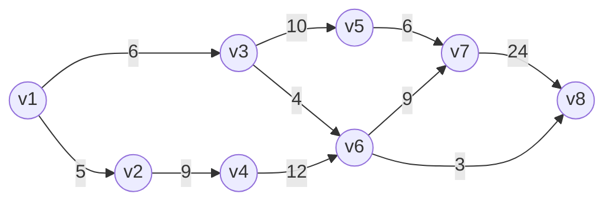

+++
title = '拓扑排序'
date = 2024-01-05T14:20:41+08:00
draft = false
tags = [
    '图论','拓扑排序'
]
categories = [
    '在学算法的日子里'
]
mermaid = true
+++


## 拓扑排序

前提：拓扑排序是对<u>有向无环图</u>来说的，无向图、有环图都不存在拓扑排序。

拓扑排序是将图G中的所有顶点排成一个线性序列，使得对于任意一堆有边顶点<u, v>，在线性序列中，u都出现在v之前。

拓扑排序可以反应某种方案是否是切实可行的。

一般一个图是否是有向图我们分析题意要求就能知道，但是究竟有没有环存在，就不是瞄一眼就能发现的了，所以，虽然拓扑排序是针对有向无环图而言的一种性质，但是反过来，一个有向图是否有拓扑排序，也可以反过来解决该图是否存在环、以及存在多少环等等问题，也就是某种方案可不可行。


接下来我们通过代码学习如何获得一个有向图的拓扑排序：


### 算法思路

拓扑排序一定是从入度为0的顶点开始的（假如入度不为0不就是有点要排在它的前面了嘛qwq），所以，我们通过删除点(及由该点出发的所有边)的方法可以不断更新制作拓扑排序时当前图的状态，这样的步骤不断执行，直到图中能删的点(入度为0的点)都删光了，我们的程序就执行到了终点。


### 程序实现

<u>我们还是用链式前向星来存储图</u>

使用队列来记录我们的拓扑序列（说是队列不过其实还是个每次只读末尾的数组啦，也没用到queue容器qwq）


寻找拓扑序列样例代码：

```cpp
// 要先用一个数组记录各个顶点最初的入度，这个数组可以在读入边数据的时候进行++记录

int queue[maxn];
int iq = 0;	// 表示当前队列长度，起始当然是0啦(懒得iq++也可以直接懒人向量法)

// 先将图里入度为0的顶点加入队列
// 第一层入度为0的点，其顺序就只是存储顺序决定哩，而且不重要(除非想找所有的拓扑排序qwq)
for (int i = 1;i <= n;i++)
    if (indegree[i] == 0)
        queue[iq++] = i;

// 删点，对队列做更新
for (int i = 0;i < iq;i++) {
    // 按队列顺序删点删边(终点的入度--就算删掉这条边了)
    for (int k = head[queue[i]];k != 0;k = Edge[k].next) {
        indegree[Edge[k].to]--;
        if (indegree[Edge[k].to] == 0)
            queue[iq++] = Edge[k].to;
    }
}
```

这时候我们得到了一个序列，其实这个序列无论如何都能得到（空序列也是序列！），所以接下来需要判断一下是否是拓扑序列，同时也就判断出当前的图是不是有向无环图啦。

判断样例代码：

```cpp
cout << "iq=" << iq << " n=" << n << endl;
	if (iq == n) {
		cout << "有拓扑序列：" << endl;
		
		// 输出拓扑排序序列
		for (int i = 0;i < iq;i++)
			cout << queue[i] << " ";
		cout << endl;
	}
	else {
		cout << "没有拓扑序列" << endl;
	}
```


前面的输入样例是个有向有环图，这里添加一组有向无环图的样例用于学习：




```plaintext
8 10
1 2 5
1 3 6
2 4 9
3 5 10
3 6 4
4 6 12
5 7 6
6 7 9
6 8 3
7 8 24
```


完整代码：

```cpp
#include<bits/stdc++.h>
using namespace std;
const long long maxn = 1e5 + 50, maxm = 1e7 + 50;

struct EdgeNode {
	int to;		// 终点
	int w;		// 权值
	int next;	// 下一位置
};

EdgeNode Edge[maxm];
int head[maxn];
int indegree[maxn];

int main() {
	int n, m;
	cin >> n >> m;

	// 初始化head
	memset(head, -1, sizeof(head));		// 初始化为0应该也冇问题，反正只是方便我们判断终点啦，想用向量也行qwq

	// 读入数据
	for (int i = 0;i < m;i++) {
		int fi, ti, wi;
		cin >> fi >> ti >> wi;
		Edge[i].to = ti;
		Edge[i].w = wi;
		
		Edge[i].next = head[fi];
		head[fi] = i;

		// 记录各个顶点的入度(当该点是终点的时候++qwq)
		indegree[ti]++;
	}

	// 要先用一个数组记录各个顶点最初的入度，这个数组可以在读入边数据的时候进行++记录

	int queue[maxn];
	int iq = 0;	// 表示当前队列长度，起始当然是0啦(懒得iq++也可以直接懒人向量法)

	// 先将图里入度为0的顶点加入队列
	// 第一层入度为0的点，其顺序就只是存储顺序决定哩，而且不重要(除非想找所有的拓扑排序qwq)
	for (int i = 1;i <= n;i++)
		if (indegree[i] == 0)
			queue[iq++] = i;

	// 删点，对队列做更新
	for (int i = 0;i < iq;i++) {
		// 按队列顺序删点删边(终点的入度--就算删掉这条边了)
		for (int k = head[queue[i]];k != -1;k = Edge[k].next) {
			indegree[Edge[k].to]--;
			if (indegree[Edge[k].to] == 0)
				queue[iq++] = Edge[k].to;
		}
	}

	// 这里可以判断是否有环啦，假如此时iq的值小于顶点的数量n，不就是说明接下来没法删边了嘛，也就是说最后剩下了环。
	cout << "iq=" << iq << " n=" << n << endl;
	if (iq == n) {
		cout << "有拓扑序列：" << endl;
		
		// 输出拓扑排序序列
		for (int i = 0;i < iq;i++)
			cout << queue[i] << " ";
		cout << endl;
	}
	else {
		cout << "没有拓扑序列" << endl;
	}

	return 0;
}

```

该算法在`O(m)`的时间内对indegree数组进行初始化，在`O(n)`时间内对queue进行初始化，后面的部分虽然看起来是两层循环，但实际上是m条边各遍历一次，所以时间复杂度只有`O(m)`而已，所以一共也就`O(m+n)`的复杂度。还是很友好滴。
