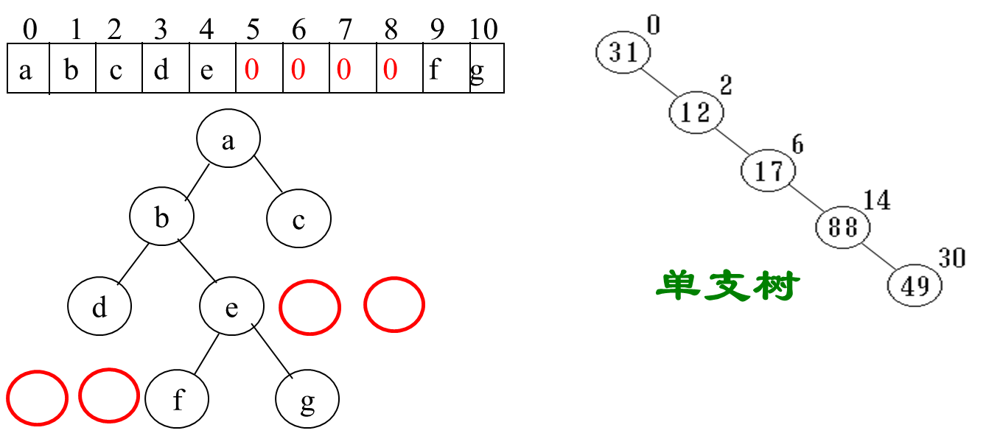
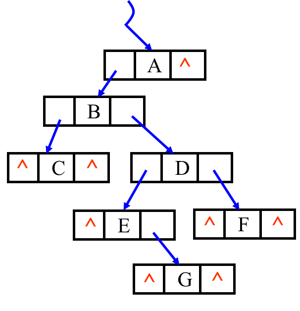
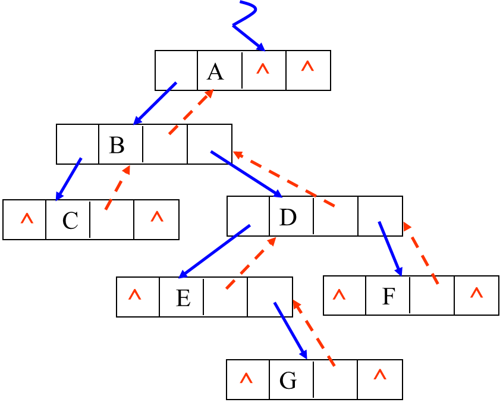
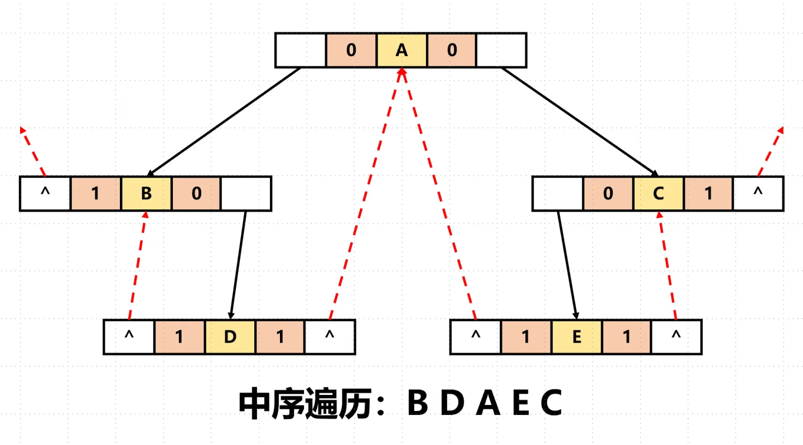

+++
title = '复习||数据结构'
date = 2024-01-04T13:49:22+08:00
lastmod = 2024-01-04T22:01:23+08:00
draft = true
tags =[
    '数据结构',
]
math = true
mermaid = true
+++
# 数据结构复习23

记录期末复习QwQ，打星的是老师画的重点。

## 绪论

数据结构有三方面的含义：逻辑结构、存储结构（物理结构）、运算（算法）
$$
数据结构
\begin{cases} 
数据的逻辑结构
\begin{cases}
线性结构
\begin{cases}
线性表\\\\栈、队列\\\\串、数组
\end{cases}\\\\
非线性结构
\begin{cases}
树型结构\\\\图型结构
\end{cases}
\end{cases}\\\\
数据的存储结构(物理结构)
\begin{cases}
顺序存储\\\\链式存储
\end{cases}\\\\
数据的运算(算法)：插入、删除、修改、查找、排序
\end{cases}
$$

### 逻辑结构

数据结构可以由一个二元组来描述：

==Data_Structure = <D, S>==

* D是数据元素的有限集（Data）
* S是D上关系的有限集（Structure）

> 例如：
>
> Linear_list = <D, S>
>
> D = {$a_1, a_2, a_3, a_4, a_5, a_6$}
>
> S={<$a_1, a_2$>, <$a_2, a_3$>, <$a_3, a_4$>, <$a_4, a_5$>, <$a_5, a_6$>}

### 物理结构

数据的逻辑结构在计算机中的表示，称此为物理结构，或称存储结构。

分类：==顺序存储结构==、==链式存储结构==

### 数据类型

一个值的集合以及定义在这个值集上的一组操作的总称。

分类：==原子类型==、==结构类型==

* 原子类型：值不可分解
* 结构类型：值由若干成分按照某种结构组成，可以分解

### 抽象数据类型

由用户定义的数据模型（Abstract Data Type）

形式：==ADT = (D, S, P)==

* D是数据对象（Data：`data member of a class.`）
* S是D上的关系集（Structure：`the set of relations between the data members are actually the logical structure of a class.`）
* P是对D的基本操作集（Procedure：`the implementations of the operations which are actually procedures, or function members of a class.`）

### 算法

算法的性质：

* 有穷性：执行有限条指令后一定要终止
* 确定性：每步定义都是确切的、无歧义的
* 可行性：算法中描述的操作都可以通过已经实现的基本运算执行有限次来实现。
* 输入：0个或多个输入
* 输出：一个或多个输出

算法设计的要求：

1. 正确性
2. 可读性
3. 健壮性
4. 效率与低存储量要求


## ✨时间复杂度

算法效率分析包括==事后统计法==、==事前分析估算法==、==时间复杂度分析==

* 时间复杂度：
  * 一个算法执行时间等于所以语句执行时间的总和
  * 一条语句执行的时间为该语句执行的次数（频度）与该语句执行一次所需时间的乘积

一个算法消耗的时间=所有语句的频度之和。

所以，**时间复杂度是由嵌套最深的语句的频度决定的**

*定义*：一般情况下，算法中基本操作重复执行的次数是问题的规模n的某个函数，算法的时间量度记作`T(n) = O(f(n))`，称作算法的<u>渐近时间复杂度</u>。

说明：

* `O`的形式定义：若`f(n)`是正整数的一个函数，则`T(n)=O(f(n))`表示存在一个正的常数M，使得当$n\geq n_0$时，都满足$|T(n)|\leq M|f(n)|$。
* 一个没有循环的算法中基本运算次数与问题规模无关，记作`O(1)`，也称为常数阶。
* 一个只有一重循环的算法中，基本运算次数与问题规模n成线性增长关系，记作`O(n)`，也称为线性阶。

### 常见时间复杂度及其增长率

|    名称    |  时间复杂度   |
| :--------: | :-----------: |
|   常数阶   |    $O(1)$     |
|   对数阶   | $O(log_2 n)$  |
|   线性阶   |    $O(n)$     |
| 线性对数阶 | $O(nlog_2 n)$ |
|   平方阶   |   $O(n^2)$    |
|   立方阶   |   $O(n^3)$    |
|   ......   |    ......     |
|  k次方阶   |   $O(n^k)$    |
|   指数阶   |   $O(2^n)$    |
|   阶乘阶   |    $O(n!)$    |

### 增长速率比较

1. ==渐近分析中常用的关系式==

常量(c)<对数($logn$)<$log^2n$<线性(n)<$nlogn$<平方($n^2$)<立方($n^3$)<指数($2^n$)<阶乘($n!$)

2. 极限法

$$
\lim_{n\rightarrow\infty}\frac{f(n)}{g(n)}=
\begin{cases}
0\quad f(n)<g(n)\\
c\quad f(n)=g(n)\\
\infty\quad f(n)>g(n)\\
\end{cases}
$$

3. 取对数

$$
\log_a(M·N)=\log_aM+\log_aN
$$

取对数后不能忽略低阶项和常数。

### 例题

> 下列代码
>
> ```plaintext
> for(i=0; i<n; i++)
>    for(j=i; j>0; j/=2)
>   		printf(“%d\n”, j);
> ```
>
> 的时间复杂度是：D
>
> A.*O*($N×i$)
>
> B.*O*(*N*)
>
> C.*O*($N^2$)
>
> D.*O*($N\log N$)
>
> 
>
> 解：对每个i第二重循环执行$\lceil \log_2i\rceil$，总时间就是$t=\sum_{i=0}^n \lceil\log_2i\rceil$

<hr/>

> 下面程序段的时间复杂度是（）。A
>
> ```plaintext
> x=90;
> y=100;
> while(y>0)
>  if(x>100)
>      { x=x-10; y--; }
>  else x++;
> ```
>
> A.*O*(1)
>
> B.*O*(*N*)
>
> C.*O*($N^2$)
>
> D.*O*($\log_2n$)
>
> 
>
> 解：常数阶

<hr/>

> 下面代码段的时间复杂度是（）。B
>
> ```plaintext
> x=0;
> for( i=1; i<n; i++ )
>  for ( j=1; j<=n-i; j++ )
>      x++;
> ```
>
> A.*O*(*n*)
>
> B.*O*($n^2$)
>
> C.*O*($n^3$)
>
> D.*O*($2^n$)
>
> 
>
> 解：对每个i第二重循环执行n-i次

## 线性表

### 线性结构

线性结构表达式：（$a_1$, $a_2$, ……, $a_n$）

线性结构特点：

1. 只有一个首结点和尾结点；
2. 除首尾结点外，其他结点只有一个直接前驱和一个直接后继。

简言之，线性结构反映结点间的逻辑关系是**一对一**的。

线性结构包括线性表、堆栈、队列、字符串、数组等等，其中，最典型、最常用的是<u>线性表</u>。


### 线性表基本操作

#### 线性表基本操作

线性表顺序存储结构在插入和删除数据元素的时候比较繁琐，但是它比较适合存取数据元素

线性表的插入操作：在第i个元素之前插入一个元素时，需将第n至第i（共n-i+1）个元素向后移动一个位置。

线性表的删除操作：删除第i个元素时需将从第i+1至第n（共n-i）个元素一次向前移动一个位置

* `Public linklist()`建立一个空的线性表
* `Public linklist(coolection c)`将collection c中的数据依次建立一个线性表
* `Public object getfirst()`返回线性表的第一个元素
* `Public object getlast()`返回线性表的最后一个元素
* `Public object removefirst()`删除线性表的第一个元素，并将该值返回
* `Public object removelast()`删除线性表的最后一个元素，并将该值返回
* `Public void addfirst(object o)`将object o插在链表的开头位置
* `Public void addlast(object o)`将object o插在链表的末尾位置
* `Public boolean contains(object o)`检查object o是否在链表中，如果存在返回true，反之返回false
* `Public int size()`返回线性表的元素个数
* `Public boolean add(object o)`将object o插入到链表的末尾，并返回true
* `Public boolean remove(object o)`将object o在链表中第一次出现的元素删除，成功返回true，失败返回false
* `Public boolean addall(collection c)`将collection c中的数据依次插入到链表的末尾
* `Public addall(int index, collection c)`将collection c中的数据依次插入到链表的index位置，并将index位置之后的元素依次插入在collection c之后，链接成一个完整的线性表
* `Public void clear()`删除线性表中的所有元素
* `Public object get(int index)`返回线性表的index位置的元素
* `Public object set(int index, object element)`以object element取代线性表index位置的元素
* `Public object remove(int index)`删除线性表中的index位置的元素
* `Public int indexof(object o)`返回object o在线性表第一次出现的位置，若不存在返回-1
* `Public nt lastindexof(object o)`返回object o在线性表最后一次出现的位置，若不存在返回-1
* `Public listiterator(int index)`返回线性表index位置开始的元素内容。

---

### 顺序表（线性表的顺序存储）

#### 顺序表定义

```cpp
#define  MAXSIZE 100	//最大长度
typedef int ElemType;
typedef  struct {
    ElemType* elem;	//指向数据元素的基地址
    int  length;	//线性表的当前长度                                     
 }SqList；
```

例子：图书表

```cpp
#define MAXSIZE 10000	//图书表可能达到的最大长度 
typedef struct			//图书信息定义
{ 
   char no[20];			//图书ISBN
   char name[50];		//图书名字
   float price; 		//图书价格
}Book;
typedef Book ElemType; 
typedef struct
{ 
   ElemType* elem;	//存储空间的基地址 
   int length;		//图书表中当前图书个数 
}SqList;		//图书表的顺序存储结构类型为SqList
```

`Dear Copilot写的顺序表基本操作：`

```cpp
#include<bits/stdc++.h>
using namespace std;
#define MAXSIZE 100
#define endl "\n"
#define status int
#define ERROR -1
#define OK 0
#define OVERFLOW -2
#define LISTINCREMENT 10
#define true 1
#define false 0

typedef int ElemType;
typedef struct {
    ElemType* elem;
    int length;
    int listsize;
}SqList;

status checkStatus(status flag);
status InitList_Sq(SqList* L, ElemType* arr);             //构造一个空的顺序表L
status getFirst(SqList L, ElemType& e);                         //获取第一个元素
status removeFirst(SqList L, ElemType& e);                      //删除第一个元素
status getLast(SqList L, ElemType& e);                          //获取最后一个元素
status removeLast(SqList L, ElemType& e);                       //删除最后一个元素
status getElem(SqList L, int i, ElemType& e);                   //获取第i个元素
status removeElem(SqList L, int i, ElemType& e);               //删除第i个元素
status addFist(SqList L, ElemType e);                           //在第一个位置添加元素
status addLast(SqList L, ElemType e);                           //在最后一个位置添加元素
status addElem(SqList L, int i, ElemType e);                    //在第i个位置添加元素
status removeElem(SqList L, ElemType e);                        //删除元素e
status contains(SqList L, ElemType e);                          //查找元素e是否存在
status isEmpty(SqList L);                                       //判断顺序表是否为空
status getSize(SqList L);                                       //获取顺序表的长度
status addAll(SqList L1, SqList L2);                            //将L2中的元素全部添加到L1中
status retainAll(SqList L1, SqList L2);                         //将L1中的元素全部删除，仅保留L2中的元素
status removeAll(SqList L1, SqList L2);                         //将L1中与L2中相同的元素全部删除
status clear(SqList L);                                         //清空顺序表
status print(SqList L);                                         //打印顺序表
status get(SqList L, int i, ElemType& e);                       //获取第i个元素
status set(SqList L, int i, ElemType e);                        //修改第i个元素
status removeRange(SqList L, int start, int end);               //删除start到end之间的元素
status subList(SqList L, int start, int end, SqList& subL);     //获取start到end之间的元素
status removeIndex(SqList L, int index, ElemType& e);           //删除index位置的元素
status addIndex(SqList L, int index, ElemType e);               //在index位置添加元素
status indexOf(SqList L, ElemType e);                           //获取元素e第一次出现的位置
status lastIndexOf(SqList L, ElemType e);                       //获取元素e最后一次出现的位置
status listIterator(SqList L);                                  //获取顺序表的迭代器
status equals(SqList L1, SqList L2);                            //判断两个顺序表是否相等
status copy(SqList L1, SqList& L2);                             //复制顺序表
status sort(SqList L);                                          //对顺序表进行排序
status reverse(SqList L);                                       //对顺序表进行反转
status LocateElem(SqList L, ElemType e, int& i);                //查找元素e

int main() {
    SqList L;
    ElemType arr[] = { 1,2,3,4,5 };
    InitList_Sq(&L, arr);
    print(L);
    ElemType e;
    getFirst(L, e);
    printf("第一个元素为：%d\n", e);
    removeFirst(L, e);
    printf("删除第一个元素后的顺序表为：");
    print(L);
    getLast(L, e);
    printf("最后一个元素为：%d\n", e);
    removeLast(L, e);
    printf("删除最后一个元素后的顺序表为：");
    print(L);
    getElem(L, 3, e);
    printf("第3个元素为：%d\n", e);
    removeElem(L, 3, e);
    printf("删除第3个元素后的顺序表为：");
    print(L);
    addFist(L, 1);
    printf("在第一个位置添加元素1后的顺序表为：");
    print(L);
    addLast(L, 5);
    printf("在最后一个位置添加元素5后的顺序表为：");
    print(L);
    addElem(L, 3, 3);
    printf("在第3个位置添加元素3后的顺序表为：");
    print(L);
    removeElem(L, 3);
    printf("删除元素3后的顺序表为：");
    print(L);
    if (contains(L, 3)) {
        printf("元素3存在！\n");
    }
    else {
        printf("元素3不存在！\n");
    }
    if (isEmpty(L)) {
        printf("顺序表为空！\n");
    }
    else {
        printf("顺序表非空！\n");
    }
    printf("顺序表的长度为：%d\n", getSize(L));
    SqList L2;
    ElemType arr2[] = { 6,7,8,9,10 };
    InitList_Sq(&L2, arr2);
    printf("顺序表L2为：");
    print(L2);
    addAll(L, L2);
    printf("将L2中的元素全部添加到L1中后的顺序表为：");
    print(L);
    retainAll(L, L2);
    printf("将L1中的元素全部删除，仅保留L2中的元素后的顺序表为：");
    print(L);
    removeAll(L, L2);
    printf("将L1中与L2中相同的元素全部删除后的顺序表为：");
    print(L);
    clear(L);
    printf("清空顺序表后的顺序表为：");
    print(L);
    get(L, 3, e);
    printf("获取第3个元素为：%d\n", e);
    set(L, 3, 3);
    printf("修改第3个元素为3后的顺序表为：");
    print(L);
    removeRange(L, 1, 3);
    printf("删除第1个到第3个元素后的顺序表为：");
    print(L);
    SqList subL;
    ElemType arr3[] = { 1,2,3,4,5 };
    InitList_Sq(&subL, arr3);
    subList(L, 1, 3, subL);
    printf("获取第1个到第3个元素后的顺序表为：");
    print(subL);
    removeIndex(L, 3, e);
    printf("删除第3个元素后的顺序表为：");
    print(L);
    addIndex(L, 3, 3);
    printf("在第3个位置添加元素3后的顺序表为：");
    print(L);
    printf("元素3第一次出现的位置为：%d\n", indexOf(L, 3));
    printf("元素3最后一次出现的位置为：%d\n", lastIndexOf(L, 3));
    printf("顺序表的迭代器为：");
    listIterator(L);
    if (equals(L, L2)) {
        printf("两个顺序表相等！\n");
    }
    else {
        printf("两个顺序表不相等！\n");
    }
    copy(L, L2);
    printf("复制顺序表L1到顺序表L2后的顺序表L2为：");
    print(L2);
    sort(L);
    printf("对顺序表进行排序后的顺序表为：");
    print(L);
    reverse(L);
    printf("对顺序表进行反转后的顺序表为：");
    print(L);
    int i;
    LocateElem(L, 3, i);
    printf("元素3第一次出现的位置为：%d\n", i);

    return 0;
}

status checkStatus(status flag) {
    if (flag == OK) {
        printf("创建成功！\n");
        return true;
    }
    else if (flag == ERROR) {
        printf("创建失败！即将返回主菜单\n");
    }
    else if (flag == OVERFLOW) {
        printf("存储分配失败！即将返回主菜单\n");
    }
    else {
        printf("未知错误！即将返回主菜单\n");
    }
    return false;
}

status InitList_Sq(SqList* L, ElemType* arr) {
    //构造一个空的顺序表L
    L->elem = (ElemType*)malloc(MAXSIZE * sizeof(ElemType));
    if (!L->elem) {
        exit(OVERFLOW);
    }
    L->length = 0;
    L->listsize = MAXSIZE;

    for (int i = 0;i < sizeof(*arr) / sizeof(ElemType);i++) {
        L->elem[i] = arr[i];
        L->length++;
    }

    return OK;
}

status removeFirst(SqList L, ElemType& e) {
    //删除第一个元素
    if (L.length == 0) {
        printf("顺序表为空！\n");
        return ERROR;
    }
    e = L.elem[0];
    for (int i = 0;i < L.length - 1;i++) {
        L.elem[i] = L.elem[i + 1];
    }
    L.length--;

    return OK;
}

status getLast(SqList L, ElemType& e) {
    //获取最后一个元素
    if (L.length == 0) {
        printf("顺序表为空！\n");
        return ERROR;
    }

    e = L.elem[L.length - 1];

    return OK;
}
status removeLast(SqList L, ElemType& e) {
    //删除最后一个元素
    if (L.length == 0) {
        printf("顺序表为空！\n");
        return ERROR;
    }
    e = L.elem[L.length - 1];
    L.length--;

    return OK;
}
status getElem(SqList L, int i, ElemType& e) {
    //获取第i个元素
    if (i < 1 || i > L.length) {
        printf("i值不合法！\n");
        return ERROR;
    }
    e = L.elem[i - 1];

    return OK;
}
status removeElem(SqList L, int i, ElemType& e) {
    //删除第i个元素
    if (i < 1 || i > L.length) {
        printf("i值不合法！\n");
        return ERROR;
    }
    e = L.elem[i - 1];
    for (int j = i - 1;j < L.length - 1;j++) {
        L.elem[j] = L.elem[j + 1];
    }
    L.length--;

    return OK;

}
status addFist(SqList L, ElemType e) {
    //在第一个位置添加元素
    if (L.length == L.listsize) {
        printf("顺序表已满！\n");
        return ERROR;
    }
    for (int i = L.length - 1;i >= 0;i--) {
        L.elem[i + 1] = L.elem[i];
    }
    L.elem[0] = e;
    L.length++;

    return OK;

}
status addLast(SqList L, ElemType e) {
    //在最后一个位置添加元素
    if (L.length == L.listsize) {
        printf("顺序表已满！\n");
        return ERROR;
    }
    L.elem[L.length] = e;
    L.length++;

    return OK;
}
status addElem(SqList L, int i, ElemType e) {
    //在第i个位置添加元素
    if (i < 1 || i > L.length + 1) {
        printf("i值不合法！\n");
        return ERROR;
    }
    if (L.length == L.listsize) {
        printf("顺序表已满！\n");
        return ERROR;
    }
    for (int j = L.length - 1;j >= i - 1;j--) {
        L.elem[j + 1] = L.elem[j];
    }
    L.elem[i - 1] = e;
    L.length++;

    return OK;
}
status removeElem(SqList L, ElemType e) {
    //删除元素e
    int i = 0;
    for (;i < L.length;i++) {
        if (L.elem[i] == e) {
            break;
        }
    }
    if (i == L.length) {
        printf("元素e不存在！\n");
        return ERROR;
    }
    for (int j = i;j < L.length - 1;j++) {
        L.elem[j] = L.elem[j + 1];
    }
    L.length--;

    return OK;
}
status contains(SqList L, ElemType e) {
    //查找元素e是否存在
    for (int i = 0;i < L.length;i++) {
        if (L.elem[i] == e) {
            return true;
        }
    }

    return false;
}
status isEmpty(SqList L) {
    //判断顺序表是否为空
    if (L.length == 0)
        return true;
    else
        return false;
}
status getSize(SqList L) {
    //获取顺序表的长度
    return L.length;
}
status addAll(SqList L1, SqList L2) {
    //将L2中的元素全部添加到L1中
    if (L1.length + L2.length > L1.listsize) {
        printf("顺序表L1的存储空间不足！\n");
        return ERROR;
    }
    for (int i = 0;i < L2.length;i++) {
        L1.elem[L1.length + i] = L2.elem[i];
    }
    L1.length += L2.length;

    return OK;
}
status retainAll(SqList L1, SqList L2) {
    //将L1中的元素全部删除，仅保留L2中的元素
    int i = 0;
    for (;i < L1.length;i++) {
        if (!contains(L2, L1.elem[i])) {
            break;
        }
    }
    if (i == L1.length) {
        printf("顺序表L1中的元素全部删除！\n");
        return ERROR;
    }
    for (int j = i;j < L1.length;j++) {
        L1.elem[j] = L1.elem[j + 1];
    }
    L1.length--;

    return OK;
}
status removeAll(SqList L1, SqList L2) {
    //将L1中与L2中相同的元素全部删除
    int i = 0;
    for (;i < L1.length;i++) {
        if (contains(L2, L1.elem[i])) {
            break;
        }
    }
    if (i == L1.length) {
        printf("顺序表L1中的元素全部删除！\n");
        return ERROR;
    }
    for (int j = i;j < L1.length;j++) {
        L1.elem[j] = L1.elem[j + 1];
    }
    L1.length--;

    return OK;
}
status clear(SqList L) {
    //清空顺序表
    L.length = 0;

    return OK;

}
status print(SqList L) {
    //打印顺序表
    for (int i = 0;i < L.length;i++) {
        printf("%d ", L.elem[i]);
    }
    printf("\n");

    return OK;
}
status get(SqList L, int i, ElemType& e) {
    //获取第i个元素
    if (i < 1 || i > L.length) {
        printf("i值不合法！\n");
        return ERROR;
    }
    e = L.elem[i - 1];

    return OK;
}
status set(SqList L, int i, ElemType e) {
    //修改第i个元素
    if (i < 1 || i > L.length) {
        printf("i值不合法！\n");
        return ERROR;
    }
    L.elem[i - 1] = e;

    return OK;
}
status removeRange(SqList L, int start, int end) {
    //删除start到end之间的元素
    if (start < 1 || start > L.length || end < 1 || end > L.length || start > end) {
        printf("start或end值不合法！\n");
        return ERROR;
    }
    for (int i = start - 1;i < end;i++) {
        for (int j = i;j < L.length - 1;j++) {
            L.elem[j] = L.elem[j + 1];
        }
        L.length--;
    }

    return OK;
}
status subList(SqList L, int start, int end, SqList& subL) {
    //获取start到end之间的元素
    if (start < 1 || start > L.length || end < 1 || end > L.length || start > end) {
        printf("start或end值不合法！\n");
        return ERROR;
    }
    if (subL.length + end - start + 1 > subL.listsize) {
        printf("顺序表subL的存储空间不足！\n");
        return ERROR;
    }
    for (int i = start - 1;i < end;i++) {
        subL.elem[subL.length + i - start + 1] = L.elem[i];
    }
    subL.length += end - start + 1;

    return OK;
}
status removeIndex(SqList L, int index, ElemType& e) {
    //删除index位置的元素
    if (index < 1 || index > L.length) {
        printf("index值不合法！\n");
        return ERROR;
    }
    e = L.elem[index - 1];
    for (int i = index - 1;i < L.length - 1;i++) {
        L.elem[i] = L.elem[i + 1];
    }
    L.length--;

    return OK;
}
status addIndex(SqList L, int index, ElemType e) {
    //在index位置添加元素
    if (index < 1 || index > L.length + 1) {
        printf("index值不合法！\n");
        return ERROR;
    }
    if (L.length == L.listsize) {
        printf("顺序表已满！\n");
        return ERROR;
    }
    for (int i = L.length - 1;i >= index - 1;i--) {
        L.elem[i + 1] = L.elem[i];
    }
    L.elem[index - 1] = e;
    L.length++;

    return OK;
}
status indexOf(SqList L, ElemType e) {
    //获取元素e第一次出现的位置
    for (int i = 0;i < L.length;i++) {
        if (L.elem[i] == e) {
            return i + 1;
        }
    }

    return 0;
}
status lastIndexOf(SqList L, ElemType e) {
    //获取元素e最后一次出现的位置
    for (int i = L.length - 1;i >= 0;i--) {
        if (L.elem[i] == e) {
            return i + 1;
        }
    }

    return 0;
}
status listIterator(SqList L) {
    //获取顺序表的迭代器
    for (int i = 0;i < L.length;i++) {
        printf("%d ", L.elem[i]);
    }
    printf("\n");

    return OK;
}
status equals(SqList L1, SqList L2) {
    //判断两个顺序表是否相等
    if (L1.length != L2.length) {
        return false;
    }
    for (int i = 0;i < L1.length;i++) {
        if (L1.elem[i] != L2.elem[i]) {
            return false;
        }
    }

    return true;
}
status copy(SqList L1, SqList& L2) {
    //复制顺序表
    if (L1.length > L2.listsize) {
        printf("顺序表L2的存储空间不足！\n");
        return ERROR;
    }
    for (int i = 0;i < L1.length;i++) {
        L2.elem[i] = L1.elem[i];
    }
    L2.length = L1.length;

    return OK;
}
status sort(SqList L) {
    //对顺序表进行排序
    for (int i = 0;i < L.length - 1;i++) {
        for (int j = 0;j < L.length - 1 - i;j++) {
            if (L.elem[j] > L.elem[j + 1]) {
                ElemType temp = L.elem[j];
                L.elem[j] = L.elem[j + 1];
                L.elem[j + 1] = temp;
            }
        }
    }

    return OK;
}
status reverse(SqList L) {
    //对顺序表进行反转
    for (int i = 0;i < L.length / 2;i++) {
        ElemType temp = L.elem[i];
        L.elem[i] = L.elem[L.length - 1 - i];
        L.elem[L.length - 1 - i] = temp;
    }

    return OK;
}
status LocateElem(SqList L, ElemType e, int& i) {
    //查找元素e
    for (i = 0;i < L.length;i++) {
        if (L.elem[i] == e) {
            return OK;
        }
    }

    return ERROR;
}
```


#### ✨代码实现——顺序表（线性表的顺序存储）的插入删除

```cpp
#include<bits/stdc++.h>
#define MAXSIZE 100
#define endl "\n"
#define status int
#define ERROR -1
#define OK 0
#define OVERFLOW -2
#define LISTINCREMENT 10

using namespace std;

typedef int ElemType;

typedef struct {
    ElemType* elem;
    int length;
    int listsize;
} SqList;

status ListInsert_Sq(SqList* L, int i, ElemType e) {
    // 在顺序线性表L中第i个位置之前插入新的元素e
    // i的合法值为1<=i<=ListLength_Sq(L)+1
    if (i < 1 || i > L->length + 1)
        return ERROR;                       // i值不合法
    
    if (L->length >= L->listsize) {         // 当前存储空间已满，增加分配
        ElemType* newbase = (ElemType*)realloc(L->elem, (L->listsize + LISTINCREMENT) * sizeof(ElemType));
        if (!newbase)
            exit(OVERFLOW);                 // 存储分配失败
        L->elem = newbase;                  // 新基址
        L->listsize += LISTINCREMENT;       // 增加存储容量
    }
    ElemType* q = &(L->elem[i - 1]);        // q为插入位置
    for (ElemType* p = &(L->elem[L->length - 1]); p >= q; --p)
        *(p + 1) = *p;                      // 插入位置及之后的元素右移
    *q = e;                                 // 插入e
    ++L->length;                            // 表长增1

    return OK;
}

status ListDelete_Sq(SqList L, int i, ElemType& e) {
    // 在顺序表L中删除第i个元素，并用e返回其值
    // i的合法值为1<=i<=ListLength_Sq(L)
    if (i < 1 || i > L.length)
        return ERROR;                       // i值不合法
    ElemType* p = &(L.elem[i - 1]);         // p为被删除元素的位置
    e = *p;                                 // 被删除元素的值赋给e
    ElemType* q = L.elem + L.length - 1;    // 表尾元素的位置
    for (++p; p <= q; ++p)
        *(p - 1) = *p;                      // 被删除元素之后的元素左移
    --L.length;                             // 表长减1

    return OK;
}

```

#### 其他整理

**查找、插入、删除算法的平均时间复杂度为O(n)**

**显然，顺序表的空间复杂度S(n)=O(1)（没有占用辅助空间）**

==顺序表的特点==

（1）利用数据元素的存储位置表示线性表中相邻数据元素之间的前后关系，即线性表的逻辑结构与存储结构一致

（2）在访问线性表时，可以快速地计算出任何一个数据元素的存储地址。因此可以粗略地认为，访问每个元素所花时间相等　

这种存取元素的方法被称为**随机存取法**

==顺序表的优缺点==

* 优点
  * 存储密度大（结点本身所占存储量结点结构所占存储量）
  * 可以随机存取表中任一元素
* 缺点
  * 在插入、删除某一元素时，需要移动大量元素
  * 浪费存储空间
  * 属于静态存储形式，数据元素的个数不能自由扩充

### 链表（线性表的链式存储结构）


#### ✨代码实现——链表（线性表的链式存储结构）的插入删除

##### 单向链表

```cpp
#include<bits/stdc++.h>
#define MAXSIZE 100
#define endl "\n"
#define status int
#define ERROR -1
#define OK 0
#define OVERFLOW -2
#define LISTINCREMENT 10

using namespace std;

typedef int ElemType;

typedef struct LNode {
    ElemType data;          // 数据域
    struct LNode *next;     // 指针域
}LNode, * LinkList;         // LNode为结点类型，LinkList为指向结点的指针类型

status getElem(LinkList L, int i, ElemType &e) { // 返回第i个元素的值
    if (i < 1 || i > getLength(L)) {
        return ERROR;
    }

    LinkList p = L->next;
    int j = 1;
    while (p && j < i) {
        p = p->next;
        j++;
    }
    e = p->data;

    return OK;
}

int findElem(LinkList L, ElemType e) { // 返回第一个值为e的元素的位序
    LinkList p = L->next;
    int i = 1;
    while (p) {
        if (p->data == e) {
            return i;
        }
        p = p->next;
        i++;
    }

    return 0;
}
status insertElem(LinkList &L, int i, ElemType e) { // 在第i个位置插入元素e
    if (i < 1 || i > getLength(L) + 1) {
        return ERROR;
    }

    LinkList p = L;
    int j = 1;
    while (p && j < i) {
        p = p->next;
        j++;
    }
    LinkList s = new LNode;
    s->data = e;
    s->next = p->next;
    p->next = s;

    return OK;
}


status ListDelete(LinkList &L, int i, ElemType &e) { // 删除第i个位置的元素
    if (i < 1 || i > getLength(L)) {
        return ERROR;
    }

    LinkList p = L;
    int j = 1;
    while (p && j < i) {
        p = p->next;
        j++;
    }
    LinkList q = p->next;
    p->next = q->next;
    e = q->data;
    delete q;

    return OK;
}
```

##### 双向链表

```cpp
#include<bits/stdc++.h>
#define MAXSIZE 100
#define endl "\n"
#define status int
#define ERROR -1
#define OK 0
#define OVERFLOW -2
#define LISTINCREMENT 10

using namespace std;

typedef int ElemType;

typedef struct DuLNode {
    ElemType data;
    struct DuLNode* prior;
    struct DuLNode* next;
} DuLNode, * DuLinkList;

status InitList(DuLinkList& L) {
    // 构造一个空的双向链表L
    L = (DuLinkList)malloc(sizeof(DuLNode));
    if (!L) exit(OVERFLOW);
    L->next = L->prior = NULL;
    return OK;
}

status getElem(DuLinkList L, int i, ElemType& e) {
    // 用e返回L中第i个元素的值
    int j = 1;
    DuLinkList p = L->next;
    while (p && j < i) {
        p = p->next;
        j++;
    }
    if (!p || j > i) return ERROR;
    e = p->data;
    return OK;
}

status ListInsertHead(DuLinkList& L, ElemType e) {
    // 在表头插入元素e
    DuLinkList s = (DuLinkList)malloc(sizeof(DuLNode));
    s->data = e;
    s->next = L->next;
    L->next->prior = s;
    s->prior = L;
    L->next = s;
    return OK;
}

status ListInsertTail(DuLinkList& L, ElemType e) {
    // 在表尾插入元素e
    DuLinkList s = (DuLinkList)malloc(sizeof(DuLNode));
    s->data = e;
    s->next = L;
    s->prior = L->prior;
    L->prior->next = s;
    L->prior = s;
    return OK;
}

status ListDeleteHead(DuLinkList& L, ElemType& e) {
    // 删除表头元素，并用e返回其值
    DuLinkList p = L->next;
    if (p == L) return ERROR;
    e = p->data;
    p->next->prior = L;
    L->next = p->next;
    free(p);
    return OK;
}

status ListDeleteTail(DuLinkList& L, ElemType& e) {
    // 删除表尾元素，并用e返回其值
    DuLinkList p = L->prior;
    if (p == L) return ERROR;
    e = p->data;
    p->prior->next = L;
    L->prior = p->prior;
    free(p);
    return OK;
}

status ListInsertOrder(DuLinkList& L, ElemType e) {
    // 有序插入元素e
    DuLinkList p = L->next;
    while (p != L && p->data < e) {
        p = p->next;
    }
    DuLinkList s = (DuLinkList)malloc(sizeof(DuLNode));
    s->data = e;
    s->next = p;
    s->prior = p->prior;
    p->prior->next = s;
    p->prior = s;
    return OK;
}

status ListDeleteElem(DuLinkList& L, ElemType e) {
    // 删除元素e
    DuLinkList p = L->next;
    while (p != L && p->data != e) {
        p = p->next;
    }
    if (p == L) return ERROR;
    p->prior->next = p->next;
    p->next->prior = p->prior;
    free(p);
    return OK;
}

status ListDeleteBetween(DuLinkList& L, int i, int j) {
    // 删除第i个到第j个元素
    int k = 1;
    DuLinkList p = L->next, q;
    while (p && k < i) {
        p = p->next;
        k++;
    }
    if (!p || k > i) return ERROR;
    while (p && k <= j) {
        q = p->next;
        p->prior->next = p->next;
        p->next->prior = p->prior;
        free(p);
        p = q;
        k++;
    }
    return OK;
}

status ListMerge(DuLinkList& La, DuLinkList& Lb, DuLinkList& Lc) {
    // 已知单链线性表La和Lb的元素按值非递减排列
    // 归并La和Lb得到新的单链线性表Lc，Lc的元素也按值非递减排列
    DuLinkList pa = La->next, pb = Lb->next, pc;
    Lc = pc = La;
    while (pa && pb) {
        if (pa->data <= pb->data) {
            pc->next = pa;
            pa->prior = pc;
            pc = pa;
            pa = pa->next;
        }
        else {
            pc->next = pb;
            pb->prior = pc;
            pc = pb;
            pb = pb->next;
        }
    }
    pc->next = pa ? pa : pb;
    pc->next->prior = pc;
    free(Lb);
    return OK;
}

```

##### 一个作业题

题意要求：已有两个升序链表L1、L2，现在构造一个函数将L1和L2拼接起来，要求拼接之后的nL1为降序，且没有重复元素。

```cpp
status mergeList(LinkList L1, LinkList L2, LinkList& nL1) {
    // 升序拼接
    LinkList pa, pb, pn;
    pa = L1->next;pb = L2->next;
    pn = nL1;
    while (pa->next && pb->next) {
        if (pa->data > pb->data) {
            pn->next = pb;
            pb = pb->next;
        }
        else {
            pn->next = pa;
            pa = pa->next;
        }
        pn = pn->next;
    }
    while (pa->next) {
        pn->next = pa;
        pa = pa->next;
        pn = pn->next;
    }
    while (pb->next) {
        pn->next = pb;
        pb = pb->next;
        pn = pn->next;
    }

    // 翻转
    LinkList pc, pd;
    pc = nL1;
    pd = nL1->next;
    pc->next = NULL;
    while (pd) {
        LinkList tmp = pd->next;
        pd->next = pc;
        pc = pd;
        pd = tmp;
    }
    nL1 = pc;

    // 去重
    LinkList pe, pf;
    pe = nL1->next;
    pf = nL1->next->next;
    while (pf) {
        if (pe->data == pf->data) {
            LinkList tmp = pf->next;
            pe->next = tmp;
            pf = tmp;
            continue;
        }
        pe = pe->next;
        pf = pf->next;
    }

    free(L1);
    free(L2);

    return OK;
}
```


#### 其他整理

**查找:  因线性链表只能顺序存取，即在查找时要从头指针找起，查找的时间复杂度为 O(n)。**

**插入和删除:  因线性链表不需要移动元素，只要修改指针，一般情况下时间复杂度为 O(1)。**

**但是，如果要在单链表中进行前插或删除操作，由于要从头查找前驱结点，所耗时间复杂度为 O(n) 。**

==链式存储结构==

1. 结点：数据元素的存储映像。由数据域和指针域两部分组成
2. 链表**：** n 个结点由指针链组成一个链表。它是线性表的链式存储映像，称为线性表的链式存储结构
3. 单链表、双链表、循环链表：
   * 结点只有一个指针域的链表，称为单链表或线性链表
   * 有两个指针域的链表，称为双链表
   * 首尾相接的链表称为循环链表

结点在存储器中的位置是任意的，即逻辑上相邻的数据元素在物理上不一定相邻

线性表的链式表示又称为非顺序映像或链式映像。


==链表逻辑结构的两种形式==

1. 无头结点


2. 有头结点


==链表特点==

（1）结点在存储器中的位置是任意的，即逻辑上相邻的数据元素在物理上不一定相邻

（2）访问时只能通过头指针进入链表，并通过每个结点的指针域向后扫描其余结点，所以寻找第一个结点和最后一个结点所花费的时间不等

这种存取元素的方法被称为**顺序存取法**

==链表的优缺点==

* 优点
  * 数据元素的个数可以自由扩充
  * 插入、删除等操作不必移动数据，只需修改链接指针，修改效率较高
* 缺点
  * 存储密度小
  * 存取效率不高，必须采用顺序存取，即存取数据元素时，只能按链表的顺序进行访问（顺藤摸瓜）

## 栈和队列

### 顺序栈的表示


==空栈==

`base == top` 是栈空标志
stacksize = 4

top 指示真正的**栈顶元素之上**的下标地址

栈满时的处理方法：

1. 报错，返回操作系统。
2. 分配更大的空间，作为栈的存储空间,将原栈的内容移入新栈。

### ✨出栈顺序(小题)

> 若元素a、b、c、d、e、f依次进栈，允许进栈、退栈操作交替进行，但不允许连续三次进行退栈工作，则不可能得到的出栈序列是？D
>
> A.b c a e f d
>
> B.c b d a e f
>
> C.d c e b f a
>
> D.a f e d c b

---

> 有六个元素以6、5、4、3、2、1的顺序进栈，问哪个不是合法的出栈序列？B
>
> A.2 3 4 1 5 6
>
> B.3 4 6 5 2 1
>
> C.5 4 3 6 1 2
>
> D.4 5 3 1 2 6

---

> 设一个堆栈的入栈顺序是1、2、3、4、5。若第一个出栈的元素是4，则最后一个出栈的元素必定是：D
>
> A.1
>
> B.3
>
> C.5
>
> D.1或者5

---

> 某队列允许在其两端进行入队操作，但仅允许在一端进行出队操作。若元素a、b、c、d、e依次入此队列后再进行出队操作，则不可能得到的出队序列是：D
>
> A.b a c d e
>
> B.d b a c e
>
> C.e c b a d
>
> D.d b c a e

---

> 给定一个堆栈的入栈序列为{ 1, 2, ⋯, *n* }，出栈序列为{ *p*1, *p*2, ⋯, *p**n* }。如果*p*2=*n*，则存在多少种不同的出栈序列？B
>
> A.n
>
> B.n−1
>
> C.2
>
> D.1

---

> 现有队列 Q 与栈 S，初始时 Q 中的元素依次是{ 1, 2, 3, 4, 5, 6 }（1在队头），S 为空。若允许下列3种操作：（1）出队并输出出队元素；（2）出队并将出队元素入栈；（3）出栈并输出出栈元素，则不能得到的输出序列是：C
>
> A.1, 2, 5, 6, 4, 3
>
> B.2, 3, 4, 5, 6, 1
>
> C.3, 4, 5, 6, 1, 2
>
> D.6, 5, 4, 3, 2, 1

### 代码实现操作

#### ✨初始化

```cpp
#include<bits/stdc++.h>
#define MAXSIZE 100
#define endl "\n"
#define status int
#define ERROR -1
#define OK 0
#define OVERFLOW -2
#define LISTINCREMENT 100

using namespace std;

typedef int SElemType;

typedef struct {
    SElemType* base;
    SElemType* top;
    int stacksize;
}SqStack;

status InitStack(SqStack& S) {
    // 构造一个空栈S
    S.base = new SElemType[MAXSIZE];
    if (!S.base) exit(OVERFLOW);
    S.top = S.base;
    S.stacksize = MAXSIZE;
    return OK;
}

```

#### ✨入栈

```cpp
status Push(SqStack& S, SElemType e) {
    // 插入元素e为新的栈顶元素
    if (S.top - S.base >= S.stacksize) {
        S.base = (SElemType*)realloc(S.base, (S.stacksize + LISTINCREMENT) * sizeof(SElemType));
        if (!S.base) 
            exit(OVERFLOW);
        S.top = S.base + S.stacksize;
        S.stacksize += LISTINCREMENT;
    }
    *S.top++ = e;
    return OK;
}
```

#### ✨出栈

```cpp
status Pop(SqStack& S, SElemType& e) {
    // 若栈不空，则删除S的栈顶元素，用e返回其值，并返回OK；否则返回ERROR
    if (S.top == S.base) 
        return ERROR;
    e = *--S.top;
    return OK;
}
```

#### 一些其他操作

```cpp
status GetTop(SqStack S, SElemType& e) {
    // 若栈不空，则用e返回S的栈顶元素，并返回OK；否则返回ERROR
    if (S.top == S.base) return ERROR;
    e = *(S.top - 1);
    return OK;
}

status StackEmpty(SqStack S) {
    // 若栈S为空栈，则返回TRUE，否则返回FALSE
    if (S.top == S.base) return true;
    else return false;
}

status StackLength(SqStack S) {
    // 返回S的元素个数，即栈的长度
    return S.top - S.base;
}

status StackTraverse(SqStack S, status(*visit)(SElemType)) {
    // 从栈底到栈顶依次对栈中每个元素调用函数visit()。一旦visit()失败，则操作失败
    while (S.top > S.base) {
        visit(*S.base++);
    }
    return OK;
}

status visit(SElemType e) {
    cout << e << " ";
    return OK;
}

status ClearStack(SqStack& S) {
    // 把S置为空栈
    S.top = S.base;
    return OK;
}

status DestroyStack(SqStack& S) {
    // 销毁栈S，S不再存在
    free(S.base);
    S.base = NULL;
    S.top = NULL;
    S.stacksize = 0;
    return OK;
}

```


## 字符串

### 串的存储表示

* 串的顺序存储表示
* 串的链式存储表示

```cpp
#include<bits/stdc++.h>
#define MAXSIZE 100
#define endl "\n"
#define status int
#define ERROR -1
#define OK 0
#define OVERFLOW -2
#define CHUNKSIZE 80

using namespace std;

// 串的顺序存储表示
typedef struct {
    char* ch; // base address
    int length; // length
}HString;

// 串的链式存储表示
typedef struct Chunk {
    char ch[CHUNKSIZE]; // chunk
    struct Chunk *next; // next chunk
} Chunk;

typedef struct {
    Chunk *head, *tail; // head and tail pointer
    int curlen; // current length
} LString;

```

### 字符串匹配算法

比较详细的介绍有关字符串匹配的算法可以参考这篇[博文](/posts/knowledge/algorithm/string_match/)

又称模式匹配(pattern matching)，主要描述的问题为：`给定字符串：主串S和子串T，在S中寻找子串T。其中T成为模式串（pattern）。`

#### BF匹配算法

```cpp
vector<int> BF_match(string s, string p) {
    // s是主串，p是模式串
    int n = s.size(), m = p.size();
    vector<int> res;
    for (int i = 0; i <= n - m; i++) {
        int j = 0;
        for (; j < m; j++) {
            if (s[i + j] != p[j]) break;
        }
        if (j == m)
            res.push_back(i);
    }
    return res;
}

// 另一种PPT里的写法(也不全是)
int Index(string s, string p) {
    // s是主串，p是模式串
    int n = s.size(), m = p.size();
    int i = 0, j = 0;
    while (i < n && j < m) {
        if (s[i] == p[j]) {
            i++; j++;
        }
        else {
            i = i - j + 1;  // i回溯到上次匹配首位的下一位
            j = 0;        // j回溯到模式串首位
        }
    }
    if (j == m) return i - m;   // 匹配成功,返回匹配的首位下标
    else return -1; // 匹配失败
}
```


#### KMP匹配算法

==KMP算法的时间复杂度==

设主串s的长度为n，模式串t长度为m，在KMP算法中求next数组的时间复杂度为O(m)，在后面的匹配中因主串s的下标不减即不回溯，比较次数可记为n,所以KMP算法总的时间复杂度为O(n+m)。

```cpp
vector<int> KMP_match(string s, string p) {
    // s是主串，p是模式串
    int n = s.size(), m = p.size();
    vector<int> res;
    // 计算next数组
    vector<int> next(m + 1);
    next[0] = -1;
    int i = 0, j = -1;
    while (i < m) {
        if (j == -1 || p[i] == p[j]) {
            i++; j++;
            next[i] = j;
        }
        else j = next[j];
    }
    // 匹配
    i = 0, j = 0;
    while (i < n) {
        if (j == -1 || s[i] == p[j]) {
            i++; j++;
        }
        else j = next[j];
        if (j == m) {
            res.push_back(i - m);
            j = next[j];
        }
    }
    return res;
}
```


##### ✨KMP中求next值

```cpp
vector<int> getNext(string p) {
    int m = p.size();
    vector<int> next(m + 1);
    next[0] = -1;
    int i = 0, j = -1;
    while (i < m) {
        if (j == -1 || p[i] == p[j]) {
            i++; j++;
            next[i] = j;
        }
        else j = next[j];
    }
    return next;
}
```

##### ✨代码实现·求子串的操作


##### ✨可能有自定义的操作


## 树型结构

### 引入

树：没有圈圈的连通图。一种可以描述数据之间的层级关系的数据结构。

### 树的分类

==无根树==

无根树的等价定义：

* 有n个节点、n-1条边的连通无向图。
* 无向无环的连通图
* 任意两个节点之间有且仅有一条简单路径的无向图。
* 每条边都是桥的连通图
* 没有圈圈，树中加边之后将出现圈圈

==有根树==

在无根树的基础上设置一个根就成了有根树。指定根之后我们就能讨论父结点等问题。

有根树特点自然继承上文中无根树的特点，此外：

* 除了树根，每个节点都必须有且只有一个父结点，从根遍历时必须经父结点到子结点
* 从根出发能遍历整棵树
* 去掉一条边树将会被分为不连通的两棵树，去掉一个点，树将被分成不连通的两棵树或更多树
* <u>从根出发到某结点有且仅有一条路径</u>

==TIP：==有向无环图不一定是有根树，有根树都是有向无环图。

==其他定义==

* 森林：每个连通分块都是树的图
* 生成树：一个要求是树的连通无向图的生成子图，也就是选n-1条边，并将所有顶点连通
* 无根树的叶子结点：度数不超过1的结点(考虑单结点图)
* 有根树的叶子结点：没有子结点的结点

==只适用于有根树的定义==

* 结点的深度：到根结点的路径上的边数
* 高度：对任意节点n，n的高度是为从n到叶子结点的最长路径长，所有叶子结点的高度为0
* 树的深度/高度：所有结点深度的最大值
* 子树：删掉和父亲相连的边之后，该结点所在的子图

others：父亲/祖先/子结点/兄弟/后代

==特殊的树==

* 链：满足任意结点的度不大于2的树
* 菊花/星星：存在结点u，其余结点均与u相连
* 有根二叉树：每个结点最多有两个儿子(可再按顺序分为左子和右子)
* 完整二叉树：每个结点的子节点数目为0或2
* 完全二叉树：只有最下面两层的度数可以小于2，且最下面一层按顺序集中在左侧连续，与结点编号对应
* 完美二叉树(满二叉树)：每层都含有最多的结点

### ✨树的存储

==只记录父节点==

用一个数组parent[N]来记录每个结点的父亲结点，不便于自顶向下的遍历，常用于自底向上的递推问题。

==邻接表==

对于无根树：和图论中的相同，给每个结点一个线性列表，记录与之相连的结点

对于有根树：若仍然是无向图，依然可以按照上述方式存储(需要区分结点上下的关系)；

若数据是可以反应结点上下关系的，可以根据这个信息制作其子结点的线性表，若有需要可以再另开一个数组记录父节点。

==左右子表示法==

做一个struct结构数组，struct中存储该结点下的某一个子节点(child)，和下一个兄弟节点(sib)

```cpp
struct Node{
    int child;		// 若无子节点则为-1或0
    int sib;		// 若无下一个兄弟节点则为-1或0
}node[maxn];
```

遍历子节点方式like this:

```cpp
int v = child[u];  // 从第一个子节点开始
while (v != -1)
{
    // ...
    // 处理子节点 v
    // ...
	v = sib[v];  // 转至下一个子节点, 即 v 的下一个兄弟
}
```

或者for循环：

```cpp
for (int v = child[u]; v != EMPTY_NODE; v = sib[v])
{
    // ...
    // 处理子节点
    // ...
}
```

==二叉树==

因为二叉树下各个结点的子节点不会超过2个，所以使用一个静态数组就能实现二叉树

```cpp
//定义一个大小为N的结构体数组
struct Node
{
	char value;      
	int lson, rson;    //左右孩子
}tree[N];

left_child=parent*2

right_child=parent*2+1
```

### ✨树的遍历

==树上DFS==

* 二叉树的DFS

  ==先序遍历==：根、左、右

  ==中序遍历==：左、根、右

  ==后序遍历==：左、右、根

实现的时候不断转移根的位置来确定左右

（记忆：

先序就是从根节点开始，从左边最外围绕着树画一个圈，画圈的顺序里，第一次遍历到的顺序就是遍历出的顺序

中序就是一棵树摆放整齐之后<del>(敲一下根节点)</del>，每个节点垂直落下来形成的从左到右顺序

后序就是从根节点开始，从左边最外围绕着树画一个圈，画圈的顺序里，最后一次遍历到的顺序就是遍历出的顺序

还有一个层序遍历，从上到下、每层从左到右的顺序。

这三种的代码：

```cpp
typedef struct BiNode
{
    int data;
    struct BiNode* lchild, * rchild;
}BiNode, * BiTree;

void preOrderTree(BiTree T) {
    // 先序遍历
    if (T) {
        cout << T->data << " ";
        preOrderTree(T->lchild);
        preOrderTree(T->rchild);
    }
}

void inOrderTree(BiTree T) {
    // 中序遍历
    if (T) {
        inOrderTree(T->lchild);
        cout << T->data << " ";
        inOrderTree(T->rchild);
    }
}

void postOrderTreee(BiTree T) {
    // 后序遍历
    if (T) {
        inOrderTree(T->lchild);
        inOrderTree(T->rchild);
        cout << T->data << " ";
    }
}
```

小题复习：

> 根据中序+后序获得前序：
>
> ```cpp
> #include<bits/stdc++.h>
> using namespace std;
> typedef long long ll;
> 
> typedef struct BiNode {
>     int data;
>     struct BiNode* lchild, * rchild;
> }BiNode, * BiTree;
> 
> int n;
> int postTree[50];
> int inTree[50];
> 
> BiTree buildTree(int itree[], int ptree[], int len) {
>     if (!len)return NULL;
>     BiTree T = (BiTree)malloc(sizeof(struct BiNode));
>     T->data = ptree[len - 1];       // 后序遍历的最后一个节点是根节点
>     T->lchild = NULL;
>     T->rchild = NULL;
>     int i = 0;
>     while (i < len) {
>         if (T->data == *(itree + i))break;
>         i++;
>     }
>     T->lchild = buildTree(itree, ptree, i);
>     T->rchild = buildTree(itree + i + 1, ptree + i, len - i - 1);
> 
>     return T;
> }
> 
> void PreTree(BiTree T) {
>     if (!T)return;
>     cout << T->data << " ";
>     PreTree(T->lchild);
>     PreTree(T->rchild);
> }
> 
> int main() {
>     cin >> n;
>     for (int i = 0;i < n;i++)cin >> postTree[i];
>     for (int i = 0;i < n;i++)cin >> inTree[i];
> 
>     BiTree T = buildTree(inTree, postTree, n);
>     PreTree(T);
>     cout << endl;
> 
>     return 0;
> }
> ```

---

> 根据前序+中序得到后序
>
> ```cpp
> #include<bits/stdc++.h>
> using namespace std;
> typedef long long ll;
> 
> typedef struct BiNode {
>     int data;
>     struct BiNode* lchild, * rchild;
> }BiNode, * BiTree;
> 
> int n;
> int preTree[50];
> int inTree[50];
> 
> BiTree buildTree(int itree[], int ptree[], int len) {
>     // len是itree的长度
>     if (len <= 0)return NULL;
>     BiTree T = (BiTree)malloc(sizeof(struct BiNode));
>     T->data = *ptree;       // 前序遍历第一个是根节点
>     T->lchild = NULL;
>     T->rchild = NULL;
>     if (len == 0) {
>         return T;
>     }
>     int i = 0;
>     while (i < len) {
>         if (T->data == *(itree + i))break;
>         i++;
>     }
>     T->lchild = buildTree(itree, ptree + 1, i);
>     T->rchild = buildTree(itree + i + 1, ptree + i + 1, len - i - 1);
> 
>     return T;
> }
> 
> void PostTree(BiTree T) {
>     if (!T)return;
>     PostTree(T->lchild);
>     PostTree(T->rchild);
>     cout << T->data << " ";
> }
> 
> int main() {
>     cin >> n;
>     for (int i = 0;i < n;i++)cin >> preTree[i];
>     for (int i = 0;i < n;i++)cin >> inTree[i];
> 
>     BiTree T = buildTree(inTree, preTree, n);
>     PostTree(T);
>     cout << endl;
> 
>     return 0;
> }
> ```
>
> 

==树上BFS==

从树根开始，严格按照层次来访问结点，BFS过程也可以顺便求出各节点的深度和父节点

==有根树&无根树的遍历==

树的遍历一般都是深度优先遍历，需要注意的就是避免重复访问结点。

树是无环图因此只需要记录当前节点是从哪个结点来的，然后访问除该结点外的所有相邻结点即可避免重复访问。

```cpp
void dfs(int u, int from)
{
    // 递归进入除了 from 之外的所有子结点
    // 对于出发结点，from 为 -1，故会访问所有相邻结点，这与期望一致
    for (int v : adj[u])
    	if (v != from) dfs(v, u);
}

int EMPTY_NODE = -1;    // 一个不存在的编号
int root = 0;           // 任取一个结点作为出发点
dfs(root, EMPTY_NODE);
```

对于有根树，要区分结点的上下级关系，考察上面的遍历过程，则访问到第一个结点时from的值就是其父节点的编号，通过这个方式可以对无向的输入求出所有点的父节点以及子节点列表。

### 二叉树的性质和存储结构

* 性质1：在二叉树的第i层上至多有2^i-1^个结点（第i层上至少有1个结点）
* 性质2：深度为k的二叉树至多有2^k^-1个结点（深度为k时至少有k个结点）
* 性质3：对于任何一棵二叉树，若2度的结点数有n~2~个，则叶子数n~0~必定为n~2~＋1 （即n~0~=n~2~+1）
* 性质4:：具有n个结点的完全二叉树的深度必为`⌊log2n⌋＋1`
* 性质5：对完全二叉树，若从上至下、从左至右编号，则编号为i 的结点，其左孩子编号必为2i，其右孩子编号必为2i＋1；其双亲的编号必为i/2。

### ✨二叉树的存储

#### ✨顺序存储

按满二叉树的节点层次编号，依次存放数据元素



==特点==

结点间关系蕴含在其存储位置中

浪费空间，适于存满二叉树和完全二叉树

#### 链式存储

##### 二叉链表

```cpp
typedef struct BiNode{
   TElemType   data;
   struct  BiNode   *lchild,*rchild; //左右孩子指针
}BiNode,*BiTree; 
```



##### 三叉链表

```cpp
typedef struct TriTNode{
    TelemType data;
    struct TriTNode *lchild,*parent,*rchild;
}TriTNode,*TriTree;
```




### 线索化二叉树

对一棵二叉树中所有节点的空指针域按照某种遍历方式加线索的过程叫作线索化，被线索化了的二叉树称为线索二叉树。

知道了“前驱”和“后继”信息，就可以把二叉树看作一个链表结构，从而可以像遍历链表那样来遍历二叉树，进而提高效率。

线索二叉树数据结构示意：


标识域：

1. 如果ltag=0，表示指向节点的左孩子。如果ltag=1，则表示lchild为线索，指向节点的直接前驱
2. 如果rtag=0，表示指向节点的右孩子。如果rtag=1，则表示rchild为线索，指向节点的直接后继

数据结构：

```cpp
typedef struct BiNode {
    int data;
    int ltag, rtag;
    struct BiNode* lchild, * rchild;
}BiNode, * BiTree;

```



```cpp
void addTagIn(BiTree T, BiTree& pre) {
    if (!T) {
        addTagIn(T->lchild, pre);
    }
    if (T->lchild == NULL) {
        // 无左子，前驱
        T->ltag = 1;
        T->lchild = pre;
    }
    if (pre && pre->rchild == NULL) {
        // 无右子，后驱
        pre->rchild == T;
        pre->rtag = 1;
    }
    pre = T;
    addTagIn(T->rchild, pre);
}

void creatTagIn(BiTree T) {
    BiTree pre = NULL;
    if (T) {
        addTagIn(T, pre);
        pre->rchild = NULL;
        pre->rtag = 1;
    }
}
```


##### ✨LCA问题

似乎只有判断父节点(?)

##### ✨左子树高度右子树高度


## 图结构

比较详细的介绍有关图论基础的算法可以参考这篇[博文](/posts/knowledge/algorithm/graph_basic/)

##### ✨图的存储（领接表存储/矩阵存储

##### ✨图的DFS/BFS遍历（代码实现/脑编译出结果

##### ✨最短路算法（Dij

有关最短路算法可以参考这篇[博文](/posts/knowledge/algorithm/shortest_path/)

##### ✨最小生成树的两个算法

有关最小生成树的算法可以参考这篇[博文](/posts/knowledge/algorithm/mst/)

##### ✨环

##### ✨拓扑排序

有关拓扑排序的算法可以参考这篇[博文](/posts/knowledge/algorithm/topo/)

##### ✨二叉排序树

##### ✨哈希查找

##### ✨求平均查找长度

##### ✨折半查找(递归)

##### ✨判断树

##### ✨二叉树和森林转换

##### ✨直接插入排序（代码

##### ✨堆排序那些...

##### ✨哈夫曼树...线索

```plaintext
ld=...
rd=...
return ld>rd?++ld:++rd.

```


