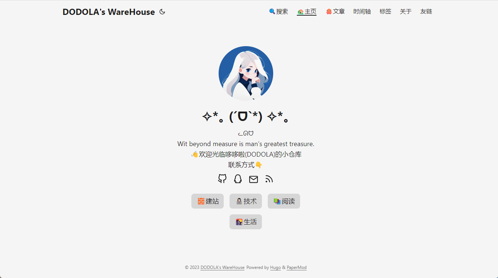

# 第壹话|基本样式


这部分是2023/11/30更新的一些基础样式设置，包括到设置友链

### 基础设置

参考：[Features · adityatelange/hugo-PaperMod Wiki (github.com)](https://github.com/adityatelange/hugo-PaperMod/wiki/Features#profile-mode)

我的初步设置一览：

```toml
# 参考：https://www.sulvblog.cn/posts/blog/build_hugo/

# hugo.toml
baseURL = "https://florae006.github.io/" # 绑定的域名
title = "DODOLA's WareHouse"
paginate = 5
theme = "hugo-PaperMod" # 主题名字
languageCode = "zh-cn" # en-us

enableInlineShortcodes = true # 允许内联短码
enableRobotsTXT = true # 允许爬虫抓取到搜索引擎

buildDrafts = false
buildFuture = false
buildExpired = false

enableEmoji = true # 允许抓取emoji表情
pygmentsUseClasses = true

hasCJKLanguage = true # 自动检测是否包含 中文日文韩文 如果文中使用较多中文引号可以开启

# googleAnalytics = "" # 谷歌统计
# copyright = ""


[minify]
disableXML = true

[permalinks]
post="/:title/"

[language.en]
languageName="English"
weight=1

[[languages.en.menu.main]]
name = "🔍搜索"
url = "search"
weight = 1

[[languages.en.menu.main]]
name = "🏡主页"
url = "/"
weight = 2

[[languages.en.menu.main]]
name = "🐙文章"
url = "posts"
weight = 3

[[languages.en.menu.main]]
identifier="archives"
name = "时间轴"
url = "archives/"
weight = 20

[[languages.en.menu.main]]
identifier="tags"
name = "标签"
url = "tags"
weight = 40

[[languages.en.menu.main]]
identifier="about"
name = "关于"
url = "tags"
weight = 50

[[languages.en.menu.main]]
identifier="links"
name = "友链"
url = "links"
weight = 60

[outputs]
home = ["HTML", "RSS", "JSON"]

  
[params.profileMode]
enabled=true
title="✧*｡ (ˊᗜˋ*) ✧*｡"
subtitle="⭐️INTJ/Acmer/前端/二次元⭐️<br/>Wit beyond measure is man's greatest treasure.<br/>👋欢迎光临哆哆啦的小仓库<br/>⭐️社交账号一览👇"
imageUrl="img/dodola.png"
imageTitle="DODOLA"
imageWidth=150
imageHeight=150

  [[params.profileMode.buttons]]
  name="🧱建站"
  url="posts/startsite"

  [[params.profileMode.buttons]]
  name="👩🏻‍💻技术"
  url="posts/tech"

  [[params.profileMode.buttons]]
  name="📚书影音"
  url="posts/beauty"

  [[params.profileMode.buttons]]
  name="🌇生活"
  url="posts/life"


[params]
env = "production"
description = "Theme PaperMod - https://github.com/adityatelange/hugo-PaperMod"
author = "DODOLA"
defaultTheme = "auto"
disableThemeToggle=false
# DateFormat="2006-01-02"
ShowShareButtons = true
ShowReadingTime = true
displayFullLangName = true
ShowPostNavLinks = true
ShowBreadCrumbs = true
ShowCodeCopyButtons = true
hideFooter=false
ShowWordCounts=true
visitCount=true
ShowLastMod=true
ShowRssButtonInSectionTermList = true
ShowToc = true
TocOpen=true
comments=true
images = ["papermod-cover.png"]


  [[params.socialIcons]]
  name = "github"
  url = "https://github.com/Florae006"

  # [[params.socialIcons]]
  # name = "twitter"
  # url = "img/twitter.png"

  # [[params.socialIcons]]
  # name = "facebook"
  # url = ""

  # [[params.socialIcons]]
  # name = "instagram"
  # url = "img/instagram.png"

  [[params.socialIcons]]
  name = "QQ"
  url = "img/qq.png"

  # [[params.socialIcons]]
  # name = "WeChat"
  # url = "img/wechat.png"

  [[params.socialIcons]]
  name = "email"
  url = "mailto:flora_chen2021@163.com"

  [[params.socialIcons]]
  name = "RSS"
  url = "index.xml"


  [params.label]
  text = "DODOLA's WareHouse"
  icon = "#"
  iconHeight = 35

  [params.asset]
  favicon = "img/dodola.jpg"
  favicon16x16 = "img/dodola.jpg"
  favicon32x32 = "img/dodola.jpg"
  apple_touch_icon = "dodola.jpg"
  safari_pinned_tab = "dodola.jpg"

  [params.fuseOpts]
  isCaseSensitive = false
  shouldSort = true
  location = 0
  distance = 1_000
  threshold = 1
  minMatchCharLength = 0
  keys = [ "title", "permalink", "summary" ]

  [params.twikoo]
  version = "1.4.11"


[taxonomies]
category = "categories"
tag = "tags"
series = "series"

[markup.goldmark.renderer]
unsafe = true

[markup.highlight]
codeFences = true
guessSyntax = true
lineNos = true

[privacy.vimeo]
disabled = false
simple = true

[privacy.twitter]
disabled = false
enableDNT = true
simple = true

[privacy.instagram]
disabled = false
simple = true

[privacy.youtube]
disabled = false
privacyEnhanced = true

[services.instagram]
disableInlineCSS = true

[services.twitter]
disableInlineCSS = true

```

呈现效果：




### 搜索功能实现

PaperMod已集成 Fuse.js 实现搜索功能，相关[Fuse.js的API](https://www.fusejs.io/api/options.html#iscasesensitive)

#### 新建页面

```bash
hugo new search.md
```

修改内容

```md
+++
title = 'Search'
date = 2023-11-29T13:39:10+08:00
draft = false
summary = 'search'
placeholder= '搜索站内内容'
layout = 'search'
searchHidden = true
+++

```

如果想隐藏搜索关联框，可以设置这个参数：

```
searchHidden = true
```


在hugo.toml中

```toml
# 设置identifier
[[languages.en.menu.main]]
identifier="Search"
name = "🔍搜索"
url = "search"
weight = 1

# 添加搜索参数
[[params.fuseOpt]]
  isCaseSensitive = false
  includeMatches = true
  shouldSort = true
  location = 0
  distance = 1000
  threshold = 0.4
  minMatchCharLength = 0
  keys=['title', 'permalink', 'summary', 'content']
```

#### 搜索页展示标签列表

在`./layouts/_default/search.html`

```html
{{- if not (.Param "hideSeries")}}
{{- $taxonomies := .Site.Taxonomies.series }}
{{- if gt (len $taxonomies) 0 }}
<h2 style="margin-top: 32px">{{- (.Param "seriesTitle") | default "series" }}</h2>
<ul class="terms-tags">
    {{- range $name, $value := $taxonomies }}
    {{- $count := .Count }}
    {{- with site.GetPage (printf "/series/%s" $name) }}
    <li>
        <a href="{{ .Permalink }}">{{ .Name }} <sup><strong><sup>{{ $count }}</sup></strong></sup> </a>
    </li>
    {{- end }}
    {{- end }}
</ul>
{{- end }}
{{- end }}
{{- end }}{{/* end main */}}  <!-- 在最后一行前加入上面的代码 -->
```

在`hugo.toml`中检查是否有这项

```toml
[taxonomies]
category = "categories"
tag = "tags"
series = "series"
```

效果：


### 添加图标

PaperMod原有的图标一览：

```bash
https://github.com/adityatelange/hugo-PaperMod/wiki/Icons
```

#### 添加自定义图标

找到这个文件：`./layouts/partials/svg.html`，在里面插入这样一段（插在哪里看原来的上下文应该能看出来，这是长长的if else...）：

```html
<!-- 这里的icon_name填自定义的检索name -->
{{- else if (eq $icon_name "xxx") -}}
<!-- 这里粘贴想要的svg -->
<svg>
    <!-- 注意，要是想要图标的颜色根据主题进行变化，要在svg标签内写上 fill="currentColor" -->
    ...
</svg>
```


找想要的图标可以在这，复制svg就行：

```python
# 阿里巴巴矢量图标库
https://www.iconfont.cn/
```

之后在`hugo.toml`中这样使用（和原生的用法一模一样）：

```toml
  [[params.socialIcons]]
  name = "douban"
  url = ""
```

### 设置友链

在根目录下`.\assets\css\extended\blank.css`中添加样式内容，`\extended\blank.css`是可以覆盖已有的样式的地方，同理，我们也可以在其中添加我们想要的样式，另外，我们也可以在`\extended\`下新建一个`fiendlink.css`来写入友链卡片的样式，这是设置的友链的样式：

```css
.friend-url {
    text-decoration: none !important;
    box-shadow: none !important;
}

.myfriend {
    width: 56px !important;
    height: 56px !important;
    border-radius: 50%!important;
    padding: 2px;
    margin-top: 20px !important;
    margin-left: 14px !important;
    background-color: #fff;
}

.friend-div {
    overflow: auto;
    height: 100px;
    width: 49%;
    display: inline-block !important;
    border-radius: 5px;
    background: none;
    
    -webkit-transition: all ease-out 0.3s;
    -moz-transition: all ease-out 0.3s;
    -o-transition: all ease-out 0.3s;
    transition: all ease-out 0.3s;
}

.dark .friend-div:hover {
    background: var(--code-bg);
}

.friend-div:hover {
    /* background: var(--theme); */
    background: #e4e4e4;
    /* 我设置了随机背景色彩，后面有提到捏 */
    transition: transform 1s;
    -webkit-transform: scale(1.1);
    -moz-transform: scale(1.2);
    -ms-transform: scale(1.2);
    -o-transform: scale(1.2);
    transform: scale(1.1);
}

.friend-div:hover .friend-div-left img { 
    transition: 0.9s !important;
    -webkit-transition: 0.9s !important;
    -moz-transition: 0.9s !important;
    -o-transition: 0.9s !important;
    -ms-transition: 0.9s !important;
    transform: rotate(360deg) !important;
    -webkit-transform: rotate(360deg) !important;
    -moz-transform: rotate(360deg) !important;
    -o-transform: rotate(360deg) !important;
    -ms-transform: rotate(360deg) !important;
}

.friend-div-left {
    width: 92px;
    float: left;
    margin-right: -5px;
}

.friend-div-right {
    margin-top: 18px;
    margin-right: 18px;
}

.friend-name {
    text-overflow: ellipsis;
    font-size: 100%;
    margin-bottom: 5px;
    color: var(--primary);
}

.friend-info {
    text-overflow: ellipsis;
    font-size: 70%;
    color: var(--primary);
}

@media screen and (max-width: 600px) {
    .friend-info {
        display: none;
    }
    .friend-div-left {
        width: 84px;
        margin: auto;
    }
    .friend-div-right {
        height: 100%;
        margin: auto;
        display: flex;
        align-items: center;
        justify-content: center;
    }
    .friend-name {
        font-size: 18px;
    }
}
```

在`.\layouts\shortcodes\`下新建一个`friend.html`填入以下内容：

```html
{{- if .IsNamedParams -}}
<a target="_blank" href={{ .Get "link" }} title={{ .Get "name" }} class="friend-url">
  <div class="friend-div">
    <div class="friend-div-left">
      
    </div>
    <div class="friend-div-right">
      <div class="friend-name">{{- .Get "name" -}}</div>
      <div class="friend-info">{{- .Get "description" -}}</div>
    </div>
  </div>
</a>
{{- end }}

```

之后在`.\content\`下的`links.md`写下这样的内容：


这样就能展现友链啦，像这样：


#### 实现随机背景色

如果想要每次都获得不同的背景，可以试试在`friend.html`下添加这样的js代码：

```javascript
<script>
  window.onload=function () {
    const randomHex = () => `rgba(${Math.round(Math.random()*255)}, ${Math.round(Math.random()*255)}, ${Math.round(Math.random()*255)}, 0.5)`;
    var friendArr=document.getElementsByClassName("friend-div"),temp=[];
    for(var i=0;i<friendArr.length;i++){
        friendArr[i].style.background=randomHex();
    }
  }
</script>
```

这段代码的意思就是在加载完毕之后给名片的卡片背景添加不同的色彩


