# 哆哆啦のjQuery学习笔记（超细）（23.07.28）


## 1. jQuery对象

### jQuery使用

### Dom对象和jQuery包装集对象


学习代码：

```html
<!DOCTYPE html>
<html lang="en">
<head>
    <meta charset="UTF-8">
    <meta name="viewport" content="width=device-width, initial-scale=1.0">
    <!-- JQuery引入 -->
    <script src="src/assets/js/code.jquery.com_jquery-3.7.0.js"></script>
    <title>哆哆啦のJQuery学习笔记页面</title>
</head>
<body>
    <!-- 内容框架 -->
    <div id="mydiv">文本</div>
</body>
    <!-- 
        Dom对象
            通过js方式获取的元素对象（document）
        JQuery对象
            通过jQuery方法获取的元素对象，返回的是jQuery包装集
    -->
    <script type="text/javascript">
        // Dom对象
            // 单个的Dom对象
        var divDom = document.getElementById("mydiv");
        console.log(divDom);
            // Dom对象数组
        var divsDom = document.getElementsByTagName("div")
        console.log(divsDom)
                // 会返回[]数组
            // js获取不存在的元素时：
        var spanDom = document.getElementsByTagName("span")
        console.log(spanDom)
                // 会返回空数组
        var spanDom2 = document.getElementById("myspan")
        console.log(spanDom2)

        console.log("============分割线============")

        // jQuery对象
        // 通过id选择获取元素对象   $("#id属性值")
        var divJquery = $("#mydiv");
        console.log(divJquery)
            // jQuery获取不存在的元素时：
        var spanJquery = $("#myspan")
        console.log(spanJquery)
                // 会返回空集合{}

        // Dom对象转为jQuery对象
            // 利用$()方法进行包装即可
        var divDomToJquery = $(divDom)
        console.log(divDomToJquery)

        // jQuery转Dom对象
            // 因为jQuery对象是个对象的包装集，所以欲将jQuery对象转换为Dom对象，可以通过：
            // 1.获取包装集对象中指定下标的元素；
            var divJqueryToDom = divJquery[0]
            console.log(divJqueryToDom)
            // 2.通过遍历
            $('#mydiv').each(function(){
                var divJqueryToDom1 = this
                console.log(divJqueryToDom1)

                var divJqueryToDom2 = $(this)
                console.log(divJqueryToDom2)
                // 通过遍历jQuery对象数组得到的对象是Dom对象，可以通过$()转为jQuery对象
                // 这里的this是Dom对象(divJqueryToDom1)，我们用$()方法将它转回jQuery对象(divJqueryToDom2)了
            })
    </script>
</html>
```


## 2. jQuery选择器


### 2.1 基础选择器


学习代码：

```html
<!DOCTYPE html>
<html lang="en">
<head>
    <meta charset="UTF-8">
    <meta name="viewport" content="width=device-width, initial-scale=1.0">
    <!-- JQuery引入 -->
    <script src="../assets/js/code.jquery.com_jquery-3.7.0.js"></script>
    <title>哆哆啦のJQuery学习笔记页面-02</title>
</head>
<body>
    <div id="mydiv1">id选择器<span>span中的内容</span></div>
    <div id="mydiv1" class="blue">元素选择器</div>
    <span class="blue">样式选择器</span>
</body>
    <!-- 
        基础选择器
            id选择器        #id属性值          $("#id属性值")                   选择id为指定值元素对象(如果有多个同名id，则以第一个为准)
            类选择器        .class属性值       $(".class属性值")                选择class为指定值元素对象
            元素选择器      标签名/元素名       $("标签名/元素名")               选择所有指定标签的元素对象

            通用选择器      *                  $("*")                          选择页面中所有的元素对象
            组合选择器      选择器1,选择器2,... $("选择器1,选择器2,...")         选择指定选择器的元素对象
    -->
    <script type="text/javascript">
        // id选择器     #id属性值
        var mydiv = $("#mydiv1")
        console.log(mydiv)  // 1个

        // 类选择器     .class属性值
        var clas = $(".blue")
        console.log(clas)   // 2个

        // 元素选择器     标签名/元素名
        var spans = $("span")
        console.log(spans)  // 2个

        // 通用选择器       *
        var all = $("*")
        console.log(all)    // 12个

        // 组合选择器       选择器1,选择器2,...
        var group = $("#mydiv1,div,.blue")
        console.log(group)  // 3个
        
    </script>
</html>
```


### 2.2 层次选择器

|   选择器   |        名称         |                       举例                        |
| :--------: | :-----------------: | :-----------------------------------------------: |
| 后代选择器 | ancestor descendant | $("#parent div")选择id为parent的元素的所有div元素 |
| 子代选择器 |    parent>child     |   $("#parent>div")选择id为parent的直接div子元素   |
| 相邻选择器 |      prev+next      |  $("#.blue + img")选择css类为blue的下一个img元素  |
| 同辈选择器 |    prev~sibling     |  $("#.blue ~ img")选择css类为blue的之后的img元素  |

学习代码：

```html
<!DOCTYPE html>
<html lang="en">
<head>
    <meta charset="UTF-8">
    <meta name="viewport" content="width=device-width, initial-scale=1.0">
    <!-- JQuery引入 -->
    <script src="../assets/js/code.jquery.com_jquery-3.7.0.js"></script>
    <title>哆哆啦のJQuery学习笔记页面-03</title>

    <style>
        .testColor{
            background: green;
        }
        .gray{
            background: gray;
        }
    </style>
</head>
<body>
    <div id="parent">
        层次选择
        <div class="testColor" id="child">
            父选择器
            <div class="gray">子选择器</div>
            
            
        </div>
        <div>
            选择器2<div>选择器2中的div</div>
        </div>
        <p>p元素</p>
    </div>
</body>
    <!-- 
        层次选择器
            后代选择器
                格式：父元素 指定元素（空格隔开）
                示例：$("父元素 元素")
                选择父元素的所有指定元素（包含第一代、第二代...）
            子代选择器
                格式：父元素 > 指定元素（大于号隔开）
                示例：$("父元素 > 元素")
                选择父元素的所有第一代指定元素
            相邻选择器
                格式：父元素 + 指定元素（加号隔开）
                示例：$("元素 + 指定元素")
                选择元素的下一个指定元素（只会查找下一个元素，如果元素不存在则获取不到）
            同辈选择器
                格式：元素 ~ 指定元素（波浪号隔开）
                示例：$("元素 ~ 指定元素")
                选择元素的下面的所有指定元素
     -->
     <script type="text/javascript">
        // 后代选择器
        var hd = $("#parent div")
        console.log(hd) // 4个

        // 子代选择器
        var zd = $("#parent > div")
        console.log(zd) // 2个

        // 相邻选择器
        var xl = $("#child + div")
        console.log(xl) // 1个
            // 假如相邻的不是指定元素，则返回的jQuery集是空的
            var xl2 = $("child + p")
            console.log(xl2)    // 0个

        // 同辈选择器
        var tb = $(".gray ~ img")
        console.log(tb) // 2个
     </script>
</html>
```


### 2.3 表单选择器

|      Forms       |    名称     | 举例                                                         |
| :--------------: | :---------: | :----------------------------------------------------------- |
|    表单选择器    |  `:input`   | 查找所有的input元素：`$(":input")`<br>注意：会匹配所有的input、textarea和button元素。 |
|   文本框选择器   |   `:text`   | 查找所有文本框：`$(":text")`                                 |
|   密码框选择器   | `:password` | 查找所有密码框：`$(":password")`                             |
|  单选按钮选择器  |  `:radio`   | 查找所有单选按钮：`$(":radio")`                              |
| 复选框按钮选择器 | `:checkbox` | 查找所有复选框：`$(":checkbox")`                             |
|  提交按钮选择器  |  `:submit`  | 查找所有提交按钮：`$(":submit")`                             |
|   图像域选择器   |  `:image`   | 查找所有图像域：`$(":image")`                                |
|  重置按钮选择器  |  `:reset`   | 查找所有重置按钮：`$(":reset")`                              |
|    按钮选择器    |  `:button`  | 查找所有按钮：`$(":button")`                                 |
|   文件阈选择器   |   `:file`   | 查找所有文件阈：`$(":file")`                                 |

学习代码：

```html
<!DOCTYPE html>
<html lang="en">
<head>
    <meta charset="UTF-8">
    <meta name="viewport" content="width=device-width, initial-scale=1.0">
    <!-- JQuery引入 -->
    <script src="../assets/js/code.jquery.com_jquery-3.7.0.js"></script>
    <title>哆哆啦のJQuery学习笔记页面-04</title>
</head>
<body style="text-align: center;">
    <h1>表单选择器</h1>
    <form action="" id="myform" name="myform" method="psot">
        <input type="hidden" name="uno" id="" value="9999" disabled="disabled">
        姓名：<input type="text" id="uname" name="uname" >
        <br>
        密码：<input type="password" id="upwd" name="upwd" value="123456">
        <br>
        年龄：<input type="radio" name="uage" value="0" checked="checked">未成年嗷
            <input type="radio" name="uage" value="1">成年嗷
        <br>
        爱好：<input type="checkbox" name="ufav" value="唱">唱
            <input type="checkbox" name="ufav" value="跳">跳
            <input type="checkbox" name="ufav" value="rap">rap
            <input type="checkbox" name="ufav" value="篮球">篮球
        <br>
        来自：<select name="ufrom" id="ufrom">
                <option value="Gryffindor">Gryffindor</option>
                <option value="Hufflepuff">Hufflepuff</option>
                <option value="Ravenclaw">Ravenclaw</option>
                <option value="Slytherin"></option>
            </select>
        <br>
        简介：<textarea name="uintro" id="" cols="30" rows="10"></textarea>
        <br>
        头像：<input type="file" name="" id="">
        <br>
        <input type="image" src="../assets/img/16.webp" width="600px" height="400px">
        <br>
        <button type="submit" onclick="return checkForm();">提交</button>
        <button type="reset">重置</button>
    </form>
</body>
    <!-- 
        表单选择器
            表单选择器          :input      查找所有的input元素：$(":input")注意：会匹配所有的input、textarea和button元素。
            文本框选择器        :text       查找所有文本框：$(":text")
            密码框选择器        :password   查找所有密码框：$(":password")
            单选按钮选择器      :radio      查找所有单选按钮：$(":radio")
            复选框按钮选择器    :checkbox   查找所有复选框：$(":checkbox")
            提交按钮选择器      :submit     查找所有提交按钮：$(":submit")
            图像域选择器        :image      查找所有图像域：$(":image")
            重置按钮选择器      :reset      查找所有重置按钮：$(":reset")
            按钮选择器          :button     查找所有按钮：$(":button")
            文件阈选择器        :file       查找所有文件阈：$(":file")`
     -->
     <script>
        // 表单选择器
        var inputs = $(":input")
        console.log(inputs) // 15个（input家族：input*11 + select*1 + textarea*1 + button*2）

        // 如果不加冒号(:)，就会是元素选择器
        // 元素选择器
        var inputs2 = $("input")
        console.log(inputs2)    // 11个（input元素*11）

        // 文本框选择器
        var texts = $(":text")
        console.log(texts)  // 1个
        
        // 密码框选择器
        var passwords = $(":password")
        console.log(passwords)  // 1个

        // 单选框选择器
        var radioes = $(":radio")
        console.log(radioes)    // 2个

        // 复选框按钮选择器
        var checkboxes = $(":checkbox")
        console.log(checkboxes) // 4个

        // 提交按钮选择器
        var submits = $(":submit")
        console.log(submits)    // 1个

        // 图像域按钮选择器
        var images = $(":image")
        console.log(images)     // 1个

        // 重置按钮选择器
        var resets = $(":reset")
        console.log(resets)     // 1个

        // 按钮选择器
        var buttons = $(":button")
        console.log(buttons)    // 2个

        // 文件域选择器
        var files = $(":file")
        console.log(files)      // 1个
     </script>
</html>
```


## 3. jQuery Dom操作

jQuery也提供了对HTML节点的操作，而且在原生JS的基础上进行了优化，使用起来更加方便。

常用的从几个方面来操作：

* 查找元素（选择器已实现）；

* 创建节点元素；

* 访问和设置节点元素的值以及属性；

* 添加节点；

* 删除节点；

* 删除、添加、修改、设定节点的CSS样式；

  

  **注意：以下的操作只适用于jQuery对象**

### 3.1 操作元素的属性

| 方法           | 说明                                                         | 举例                                |
| -------------- | ------------------------------------------------------------ | ----------------------------------- |
| attr(属性名称) | 获取指定的属性值<br>操作checkbox时，选中时返回checked，没有选择返回undefined。 | `attr('checked')`<br>`attr('name')` |
| prop(属性名称) | 获取具有true和false两个属性的属性值                          | `prop('checked')`                   |

#### 3.1.1 获取属性

`attr("属性名")`
`prop("属性名")`

#### 3.1.2 设置属性

`attr("属性名", "属性值")`
`prop("属性名", "属性值")`

#### 3.1.3 移除属性

`removeAttr("属性名")`

学习代码：

```html
<!DOCTYPE html>
<html lang="en">
<head>
    <meta charset="UTF-8">
    <meta name="viewport" content="width=device-width, initial-scale=1.0">
    <!-- JQuery引入 -->
    <script src="../assets/js/code.jquery.com_jquery-3.7.0.js"></script>
    <title>哆哆啦のJQuery学习笔记页面-05</title>
</head>
<body>
    <form action="" id="myform">
        <input type="checkbox" name="ch" id="aa" sentence="first" checked="checked">悟已往之不谏
        <input type="checkbox" name="ch" id="bb" sentence="second">知来者之可追
        <!-- 这里的sentence属性是我们自己添加的，并不是input元素原生的属性 -->
    </form>
</body>
    <!-- 
        操作元素的属性
            属性的分类：
                固有属性：元素本身就有的属性（id\name\class\...）
                返回值是Boolean类型的属性：checked\selected\disabled
                自定义属性：用户自己定义的属性
            
            attr()和prop()的区别：
                1. 如果是固有属性，attr()和prop()方法均可操作
                2. 如果是自定义属性，attr()可操作，prop()不可操作
                3. 如果是返回值是Boolean类型的属性
                    若设置了属性，attr()返回具体的值，prop()返回true
                    若未设置属性，attr()返回undefined，prop()返回false
            
            1.获取属性
                attr("属性名")
                prop("属性名")
            2.设置属性
                attr("属性名", "属性值")
                prop("属性名", "属性值")
            3.移除属性
                removeAttr("属性名")

        总结：
            如果属性的类型是Boolean(checked\selected\disabled)，则使用prop()方法，否则使用attr()方法。
     -->
     <script>
        // 获取name属性
        // 固有属性：使用attr()和prop()都可以得到固有属性
        var name = $("#aa").attr("name");
        console.log(name)   // ch
        var name2 = $("#aa").prop("name");
        console.log(name2)  // ch

        // 返回值是Boolean类型的属性：
            // 1. 元素设置了属性的：attr()返回具体的值，prop()返回true
        var ck1 = $("#aa").attr("checked")
        console.log(ck1)    // checked
        var ck2 = $("#aa").prop("checked")
        console.log(ck2)    // true
            // 2. 元素没有设置属性的：attr()返回undefined，prop()返回false
        var ck3 = $("#bb").attr("checked")
        console.log(ck3)    // undefined
        var ck4 = $("#bb").prop("checked")
        console.log(ck4)    // false

        // 自定义属性：attr()可获取，prop()不可获取
        var sentence1 = $("#aa").attr("sentence")
        console.log(sentence1)  // first
        var sentence2 = $("#aa").prop("sentence")
        console.log(sentence2)  // undefined

        console.log("=======分割线=======")

        // 设置属性
        // 固有属性
        $("#aa").attr("value", "1")
        $("#bb").prop("value", "2")

        // 返回值是Boolean类型的属性
        $("#bb").attr("checked", "checked")
        $("#bb").prop("checked", false)

        // 自定义属性
        $("#aa").attr("writer", "陶渊明")
        $("#aa").prop("dynasty", "Jin")
            // 这部分的运行结果可以通过Elements查看（属性操作结果1）
            // 只有attr()操作的writer被成功设置，prop()失败


        // 移除属性
        $("#aa").removeAttr("checked")  // 结果就是"悟已往之不谏"显示不再被选中（属性操作结果2）
     </script>
</html>
```

属性操作结果1：


属性操作结果2：


### 3.2 操作元素的样式

元素的样式也是一种属性，由于样式用的特别多，所以对于样式除了当做属性处理外还可以有专门的方法进行处理。

| 方法                      | 说明                          |
| ------------------------- | ----------------------------- |
| `attr("class")`           | 获取class属性的值，即样式名称 |
| `attr("class", "样式名")` | 修改class属性的值，修改样式   |
| `addClass("样式名")`      | 添加样式的名称                |
| `css()`                   | 添加具体的样式                |
| `removeClass(class)`      | 移除样式名称                  |

**增加元素的具体样式的格式：**

```
1) css({'样式名1':'样式值1', '样式名2':'样式值2', '样式名3':'样式值3',...})
例：css({"background-color": "red", "color": "#fff"})

2) css("样式名", "样式值")
例：css('color', 'black')
```

学习代码：

```html
<!DOCTYPE html>
<html lang="en">
<head>
    <meta charset="UTF-8">
    <meta name="viewport" content="width=device-width, initial-scale=1.0">
    <!-- JQuery引入 -->
    <script src="../assets/js/code.jquery.com_jquery-3.7.0.js"></script>
    <title>哆哆啦のJQuery学习笔记页面-06</title>
    <style>
        div{
            padding: 8px;
            width: 180px;
        }
        .blue{
            background: blue;
        }
        .larger{
            font-size: 30px;
        }
        .green{
            background: green;
        }
        
        /* .pink {
            background: pink;
        }  */
        
    </style>
</head>
<body style="text-align: center;">
    <h3>css()方法设置元素样式</h3>
    <div id="conBlue" class="blue larger">So, get away.</div>
    <div id="conRed">Another way to feell what you didn't want yourself to know.</div>
    <div id="remove" class="blue larger">And let yourself go.</div>
</body>
    <!-- 
        操作元素的样式
            attr("class")           获取元素的class属性值
            attr("class", "样式名") 设置元素的样式（原本的样式会被新样式全部覆盖）
            addClass("样式名")      添加样式（在原样式中添加样式，原本的样式会保留）
            css()                   添加具体的样式（相当于添加行内样式，优先级高）
            removeClass("样式名")   移除样式
     -->
     <script>
        // attr("class")            获取元素的样式名
        var cla = $("#conBlue").attr("class")
        console.log(cla)

        // attr("class", "样式名")  设置元素的样式
        $("#conBlue").attr("class", "green")    // 原本的样式会被全部覆盖

        // addClass("样式名")       添加样式
        $("#conBlue").addClass("larger")
        $("#conBlue").addClass("pink")
        // 注意！.pink在style中的顺序会影响效果（CSS的默认显示顺序是后来居上），谁后定义显示谁（可见操作结果1）

        // css()                   添加具体的样式（添加行内样式）
        $("#conRed").css("font-size", "40px")
        $("#conRed").css({"font-family": "Impact", "color": "orange"})  // 可见操作结果2

        // removeClass("样式名")   移除样式
        $("#remove").removeClass("larger")
        // 操作结果3
     </script>
</html>
```

操作结果1：

|  | 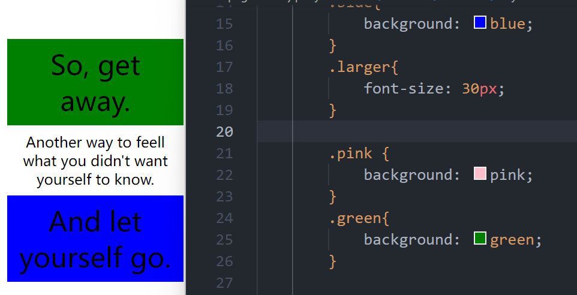 |
| ------------------------------------------------------------ | ------------------------------------------------------------ |

操作结果2：

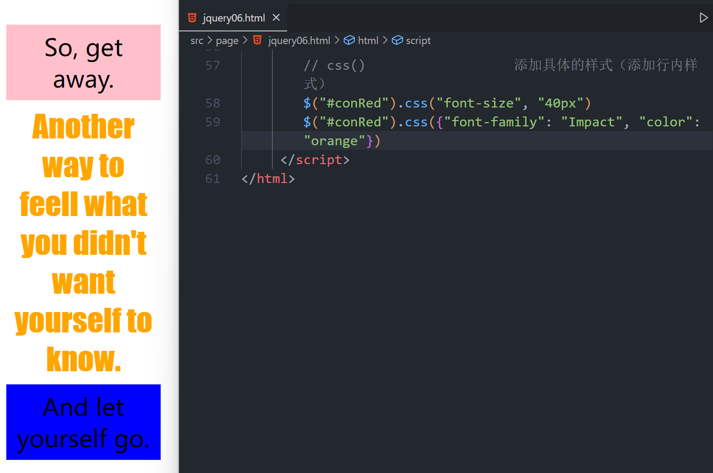

操作结果3：

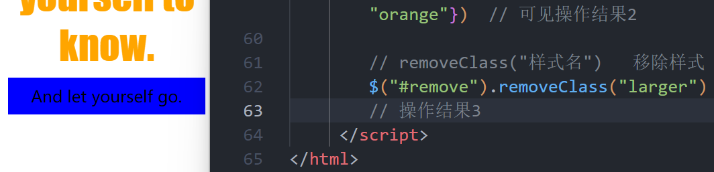

### 3.3 操作元素的内容

对于元素还可以操作其中的内容，例如文本、值、甚至是html...

| 方法                 | 说明                           |
| -------------------- | ------------------------------ |
| `html()`             | 获取元素的html内容             |
| `html("html, 内容")` | 设定元素的html内容             |
| `text()`             | 获取元素的文本内容，不包括html |
| `text("text 内容")`  | 设置元素的文本内容，不包括html |
| `val()`              | 获取元素的value值              |
| `val('值')`          | 设定元素的value值              |

学习代码：

```html
<!DOCTYPE html>
<html lang="en">
<head>
    <meta charset="UTF-8">
    <meta name="viewport" content="width=device-width, initial-scale=1.0">
    <!-- JQuery引入 -->
    <script src="../assets/js/code.jquery.com_jquery-3.7.0.js"></script>
    <title>哆哆啦のJQuery学习笔记页面-07</title>
</head>
<body>
    <h3><span>html()和text()方法设置元素内容</span></h3>
    <div id="html"></div>
    <div id="html2"></div>
    <div id="html3"><h3>============</h3></div>
    <div id="text"></div>
    <div id="text2"></div>
    <div id="text3"><h2>《贺新郎》</h2></div>
    <input type="text" name="uname" value="oops" id="op">
</body>
    <!-- 
        操作元素的内容
            html()          获取元素的内容，包含html标签（非表单元素）
            html("内容")    设置元素的内容，包括html标签（非表单元素）
            text()          获取元素的纯文本内容，不识别HTML标签（所有的标签都会被当做字符串）（非表单元素）
            text("内容")    设置元素的纯文本内容，不识别HTML标签（所有的标签都会被当做字符串）（非表单元素）
            val()           获取元素的value值（表单元素）
            val("值")       设置元素的value值（表单元素）

        表单元素：
            文本框text、密码框password、单选框radio、复选框checkbox、隐藏阈hidden、文本域textarea、下拉框select、
        非表单元素：
            div、span、h1~h6、table、tr、td、li、p等
     -->
     <script>
        // html("内容")    设置元素的内容，包括html标签（非表单元素）
        $("#html").html("<h2>我见青山多妩媚</h2>")
        $("#html2").html("料青山见我应如是")

        // html()          获取元素的内容，包含html标签（非表单元素）
        var html = $("#html").html()
        console.log(html)   // 纯文本式的：<h2>我见青山多妩媚<h2>
        var html2 = $("#html2").html()
        console.log(html2)  // 料青山见我应如是
        var html3 = $("#html3").html()
        console.log(html3)  // <h3>============</h3>
        // 注意.html()方法将其中的html标签读出来了

        // text("内容")    设置元素的纯文本内容，不识别HTML标签（所有的标签都会被当做字符串）（非表单元素）
        $("#text").text("<h2>情与貌</h2>")  // 显示并没有识别html标签（见操作结果1）
        $("#text2").text("略相似")

        //  text()          获取元素的纯文本内容，不识别HTML标签（所有的标签都会被当做字符串）（非表单元素）
        var text = $("#text").text()
        console.log(text)   // <h2>情与貌</h2>
        var text2 = $("#text2").text()
        console.log(text2)  // 略相似
        var text3 = $("#text3").text()
        console.log(text3)  // 《贺新郎》
        // 注意，原本写在#text3中是有一个<h2>标签的，但是使用text()方法时并不会将该标签读成"<h2>《贺新郎》</h2>"

        // val()           获取元素的值（表单元素）
        var val = $("#op").val()
        console.log(val)
        // val("值")       设置元素的value值（表单元素）
        $("#op").val("星如雨")

     </script>
</html>
```

操作结果1：


### 3.4 创建元素

在jQuery中创建元素很简单，直接使用核心函数即可

```js
格式：
	$("元素内容")
举例：
	$("<p>鹏北海，凤朝阳，又携书剑路茫茫。</p>")
```

代码操作示例

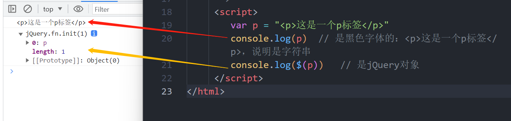

### 3.5 添加元素

| 方法                             | 说明                                                         |
| -------------------------------- | ------------------------------------------------------------ |
| `prepend(content)`               | 在被选元素内部的开头插入元素或内容，被追加的content参数，可以是字符、HTML元素标记。 |
| `$(content).prependTo(selector)` | 把content元素或内容加入selector元素开头。                    |
| `append(content)`                | 在被选元素内部的结尾插入元素或内容，被追加的content参数，可以是字符、HTML元素标记。 |
| `$(content).appendTo(selector)`  | 把content元素或内容插入selector元素内，默认是在尾部          |
| `before()`                       | 在元素前插入指定的元素或内容：$(selector).before(content)**（兄弟级别）** |
| `after()`                        | 在元素后插入指定的元素或内容：$(selector).after(content)**（兄弟级别）** |

学习代码：

```html
<!DOCTYPE html>
<html lang="en">
<head>
    <meta charset="UTF-8">
    <meta name="viewport" content="width=device-width, initial-scale=1.0">
    <!-- JQuery引入 -->
    <script src="../assets/js/code.jquery.com_jquery-3.7.0.js"></script>
    <title>哆哆啦のJQuery学习笔记页面-08</title>
    <style>
        div{
            margin: 10px 0px;
        }
        span{
            color: white;
            padding: 8px;
        }
        .red{
            background-color: red;
        }
        .blue{
            background-color: blue;
        }
        .green{
            background-color: green;
        }
        .pink{
            background-color: pink;
        }
        .gray{
            background-color: gray;
        }
    </style>
</head>
<body>
    <h3>.prepend()方法前追加内容</h3>
    <h3>.prependTo()方法前追加内容</h3>
    <h3>.append()方法后追加内容</h3>
    <h3>.appendTo()方后前追加内容</h3>

    <span class="red">江畔何人初见月？江月何年初照人？</span>
    <span class="blue">藕丝秋色浅，人胜参差剪。</span>
    <div class="green">
        <span>江流宛转绕芳甸，月照花林皆似霰。</span>
    </div>
</body>
    <!-- 
        创建元素和添加元素
            创建元素
                $("内容")
            添加元素
                1. 前追加子元素
                    指定元素.prepend(内容)      在指定元素内部的最前面追加内容，内容可以是字符串、html元素或jQuery对象
                    $(内容).prependTo(指定元素) 把内容追加到指定元素内部的最前面，内容可以是字符串、html元素或jQuery对象
                2. 后追加子元素
                    指定元素.append(内容)       在指定元素内部的最后面追加内容，内容可以是字符串、html元素或jQuery对象
                    $(内容).appendTo(指定元素)  把内容追加到指定元素内部的最后面，内容可以是字符串、html元素或jQuery对象
                3. 前追加同级元素
                    before()                    在指定元素的前面追加内容
                4. 后追加同级元素
                    after()                     在指定元素的后面追加元素
                
            注意：
                在添加元素时，如果元素本身不存在（新建的元素），此时会将元素追加到指定位置。
                如果元素本身存在（已有元素），会将原来元素直接剪切设置到指定位置。
     -->
     <script>
        // 创建元素
        var p = "<p>这是一个p标签</p>"
        console.log(p)  // 是黑色字体的：<p>这是一个p标签</p>，说明是字符串
        console.log($(p))   // 是jQuery对象

        // 添加元素
        // 添加元素前要创建元素
            // 1. 创建元素
            var span = "<span>涟涟随波千万里，何处春江无月明。</span>"
            var span2 = "<span>春江潮水连海平，海上明月共潮生。</span>"
                // 得到指定元素，并在元素的内部最前面追加内容
                $(".green").prepend(span)
                $(span2).prependTo($(".green"))
            
            var span3 = "<span>空里流霜不觉飞，汀上白沙看不见。</span>"
            var span4 = "<span>江天一色无纤尘，皎皎空中孤月轮。</span>"
                // 得到指定元素，并在元素的内部最后面追加内容
                $(".green").append(span3)
                $(span4).appendTo($(".green"))

                // 将已存在内容追加到元素中
                $(".red").appendTo($(".green"))

            // 同级追加
            var sp1 = '<span class="pink">江上柳如烟，雁飞残月天。</span>'
            var sp2 = '<span class="gray">双鬓隔香红，玉钗头上风。</span>'

            $(".blue").before(sp1)
            $(".blue").after(sp2)
     </script>
</html>
```

操作结果：

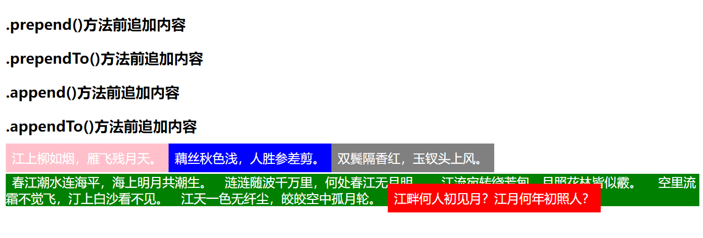

### 3.6 删除元素

学习代码：

```html
<!DOCTYPE html>
<html lang="en">
<head>
    <meta charset="UTF-8">
    <meta name="viewport" content="width=device-width, initial-scale=1.0">
    <!-- JQuery引入 -->
    <script src="../assets/js/code.jquery.com_jquery-3.7.0.js"></script>
    <title>哆哆啦のJQuery学习笔记页面-09</title>
    <style>
        span{
            color: white;
            padding: 8px;
            margin: 5px;
            float: left;
        }
        .green{
            background-color: green;
        }
        .blue{
            background-color: blue;
        }
    </style>
</head>
<body>
    <h3>删除元素</h3>
    <span class="green">Gryffindor</span>
    <span class="blue">Hufflepuff</span>
    <span class="green">Ravenclaw</span>
    <span class="blue">Slytherin</span>
</body>
    <!-- 
        删除元素
            remove()
                删除元素及其对应的子元素，标签和内容一起删
                指定元素.remove()
            empty()
                清空元素内容，保留标签
                指定元素.empty()
     -->
     <script>
        // 删除元素
        $(".green").remove()    // 操作效果1
        // 清空元素
        $(".blue").empty()      // 操作效果1
     </script>
</html>
```


操作效果1：

|                                                              |
| ------------------------------------------------------------ |
| 初始状态:                                                    |
|  |
|                                                              |
| `$(".green").remove()`操作后：                               |
| 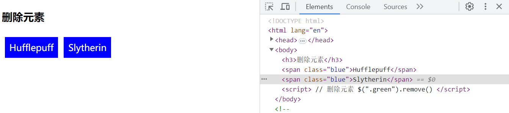 |
|                                                              |
| `$(".blue").empty()`操作后：                                 |
|  |


### 3.7 遍历元素

**`each()`**

`$(selector).each(function(index,element){})`：遍历元素

参数`function`为遍历时的回调函数

`index`为遍历元素的序列号，从0开始

`element`是当前的元素，此时是dom元素

学习代码：

```html
<!DOCTYPE html>
<html lang="en">

<head>
    <meta charset="UTF-8">
    <meta name="viewport" content="width=device-width, initial-scale=1.0">
    <!-- JQuery引入 -->
    <script src="../assets/js/code.jquery.com_jquery-3.7.0.js"></script>
    <title>哆哆啦のJQuery学习笔记页面-10</title>
    <style>
        span {
            color: white;
            padding: 8px;
            margin: 5px;
            float: left;
        }

        .green {
            background-color: green;
        }

        .blue {
            background-color: blue;
        }
    </style>
</head>

<body>
    <h3>遍历元素 each()</h3>
    <span class="green">Gryffindor</span>
    <span class="green">Hufflepuff</span>
    <span class="green">Ravenclaw</span>
    <span class="green">Slytherin</span>
</body>
    <!-- 
       each()

        $(selector).each(function(index,element){})：遍历元素，形参index和element看需求决定写不写。

        参数function为遍历时的回调函数

        index为遍历元素的序列号，从0开始

        element是当前的元素，此时是dom元素

     -->
    <script>
        // 获取指定元素并遍历
        $(".green").each(function(index, element){
            console.log(index)
            console.log(element)
            console.log(this)
            console.log($(this)) //转成jQuery对象
        })  // 操作结果1
    </script>

</html>
```


操作结果1：


## 4. jQuery事件

### 4.1 ready加载事件

`ready()`类似于`onLoad()`事件

`ready()`可以写多个，按顺序执行

`$(document).ready(function(){})`


```
语法：
    $(document).ready(function(){
        xxxx
    })
简写：
    $(function(){
        xxxx
    })
```


体会加载：

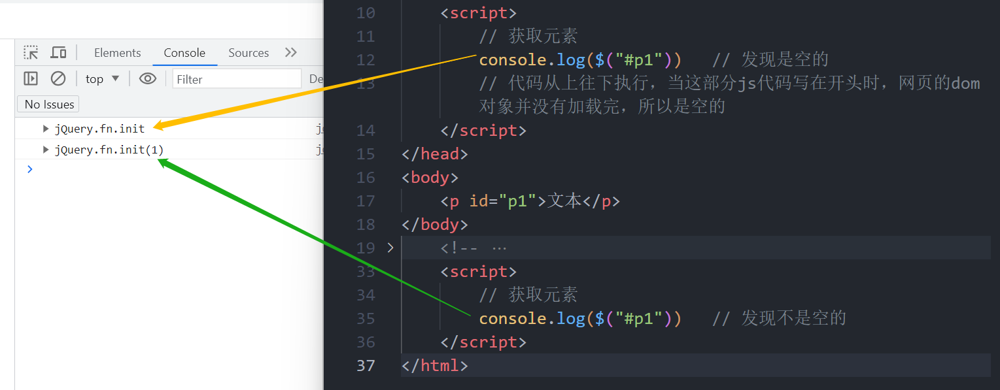

为了避免这种情况的发生，我们要将代码写到ready加载事件中

学习代码：

```html
<!DOCTYPE html>
<html lang="en">
<head>
    <meta charset="UTF-8">
    <meta name="viewport" content="width=device-width, initial-scale=1.0">
    <!-- JQuery引入 -->
    <script src="../assets/js/code.jquery.com_jquery-3.7.0.js"></script>
    <title>哆哆啦のJQuery学习笔记页面-11</title>

    <script>
        // 获取元素
        console.log($("#p1"))   // 发现是空的
        // 代码从上往下执行，当这部分js代码写在开头时，网页的dom对象并没有加载完，所以是空的

        // 预加载处理后：
        $(document).ready(function(){
            console.log($("#p1"))   // 不是空的
        })
        // 另一种简写法：
        $(function(){
            console.log($("#p1"))
        })
    </script>
</head>
<body>
    <p id="p1">文本</p>
</body>
    <!-- 
        ready加载事件
            预加载事件
            当页面的dom结构加载完毕后执行
            类似于js中load事件
            语法：
                $(document).ready(function(){
                    xxxx
                })
            简写：
                $(function(){
                    xxxx
                })
     -->
    <script>
        // 获取元素
        console.log($("#p1"))   // 发现不是空的
    </script>
</html>
```


操作结果1：

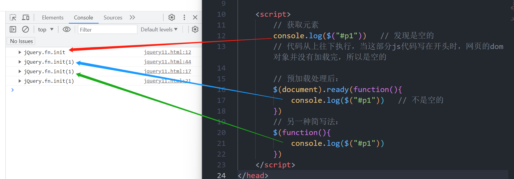

### 4.2 绑定事件

为被选元素添加一个或多个事件处理程序，并规定事件发生时运行的函数。

```
语法：
	$(selector.bind(eventType [, eventData], handler(eventObject)));
```


`eventType`：是一个字符串类型的事件类型，就是你所需要绑定的事件。

​	这类型可以包括如下：

​		**`blur`，`focus`，`focusout`，`load`，`resize`，`scroll`，`unload`，`click`，`dblclick`**

​		**`mousedown`，`mouseup`，`mousemove`，`mouseover`，`mouseout`，`mouseenter`**

​		**`mouseleave`，`change`，`select`，`submit`，`keydown`，`keypress`，`keyup`，`error`**


`[, eventData]`：传递的参数，**格式：{名1: 值1, 名2: 值2}**

`handler(eventObject)`：该事件触发执行的函数。

#### 4.2.1 简单的bind()事件

#### 4.2.2 绑定多个事件

学习代码：

```html
<!DOCTYPE html>
<html lang="en">
<head>
    <meta charset="UTF-8">
    <meta name="viewport" content="width=device-width, initial-scale=1.0">
    <!-- JQuery引入 -->
    <script src="../assets/js/code.jquery.com_jquery-3.7.0.js"></script>
    <title>哆哆啦のJQuery学习笔记页面-12</title>
</head>
<body>
    <h3>bind()方法简单的绑定事件</h3>
    <!-- style="cursor: pointer;"设置鼠标图标 -->
    <div id="test" style="cursor: pointer;">点击查看名言</div>
    <input type="button" name="" id="btntest" value="点击就会变得不可用了">
    <hr>
    <button type="button" id="btn1">按钮1</button>
    <button type="button" id="btn2">按钮2</button>
    <button type="button" id="btn3">按钮3</button>
    <button type="button" id="btn4">按钮4</button>
</body>
    <!-- 
        绑定事件
            bind绑定事件
                为被选元素添加一个或多个事件处理程序，并规定事件发生时运行的函数。
                语法：
                    $(selector.bind(eventType [, eventData], handler(eventObject)));

                        eventType：是一个字符串类型的事件类型，就是你所需要绑定的事件。
                        [, eventData]：传递的参数，格式：{名1: 值1, 名2: 值2}
                        handler(eventObject)：该事件触发执行的函数。
                绑定单个事件：
                    bind()绑定：
                        $("元素").bind("事件类型", function(){
                            xxxx
                        })
                    直接绑定：
                        $("元素").事件名(function(){
                            xxxx
                        })
                绑定多个事件：
                    bind绑定：
                        1. 同时为多个事件绑定同一个函数
                        指定元素.bind("事件类型1 事件类型2 ...", function(){
                            xxxx
                        })
                        2. 为元素绑定多个事件，并设置对应函数
                        指定元素.bind("事件类型1", function(){
                            xxxx
                        }).bind("事件类型2", function(){
                            xxxx
                        });
                        3. 为元素绑定多个事件，并设置对应的函数
                        指定元素.bind({
                            "事件类型1": function(){
                                xxxx
                            },
                            "事件类型2": function(){
                                xxxx
                            }
                            ...
                        })
                    直接绑定：
                        指定元素.事件名(function(){
                            xxxx
                        }).事件名(function(){
                            xxxx
                        });
     -->
     <script>
        /*
            1.确定为哪些元素绑定事件
                获取元素
            2.绑定什么事件（事件类型）
                第一个参数：事件的类型
            3.相应事件触发的（执行的操作）
                第二个参数：函数
        */
        // 绑定单个事件
        $("#test").bind('click', function(){     // 主要不用写成onclick，"on"就是绑定的意思，也就是bind()
            console.log("救一人，便救全世界。")
        })
        // 原生js绑定事件
        document.getElementById("test").onclick = function(){
            console.log("大海才是他的琴键。")
        }
        // 直接绑定
        $("#btntest").click(function(){
            // 禁用按钮
            console.log(this)   // this是绑定的按钮对象
            $(this).prop('disabled', true); // 点击一次后按钮变灰，按钮被禁用
        })
        // 绑定多个事件
        // 1. 同时为多个事件绑定同一个函数
        $("#btn1").bind('click mouseout',function () {
            console.log("按钮1的事件")
        })

        // 2. 为元素绑定多个事件，并设置对应函数
        $("#btn2").bind("click", function(){
            console.log("按钮2被点击了")
        }).bind("mouseout", function () {
            console.log("鼠标移开按钮2了")
        })

        // 3. 为元素绑定多个事件，并设置对应的函数
        $("#btn3").bind({
            "click": function () {
                console.log("按钮3被点击了")
            },
            "mouseout":function(){
                console.log("鼠标移开按钮3了")
            }
        })

        // 4. 直接绑定
        $("#btn4").click(function () {
            console.log("按钮4被点击了")
        }).mouseout(function(){
            console.log("鼠标移开按钮4了")
        })
     </script>
</html>
```


## 5. jQuery Ajax

**异步无刷新！**

### 5.1 $.ajax()

jQuery调用Ajax的方法：

````
格式：
	$.ajax({});
````


| 参数        | 说明                                       |
| ----------- | ------------------------------------------ |
| type        | 请求方式GET/POST                           |
| url         | 请求地址url                                |
| async       | 是否同步，默认是true表示异步               |
| data        | 发送到服务器的数据                         |
| dataType    | 预期服务器返回的数据类型（默认是字符串型） |
| contentType | 设置请求头                                 |
| success     | 请求成功时调用此函数                       |
| error       | 请求失败时调用此函数                       |

这里推荐一个vscode中的插件：Live Server

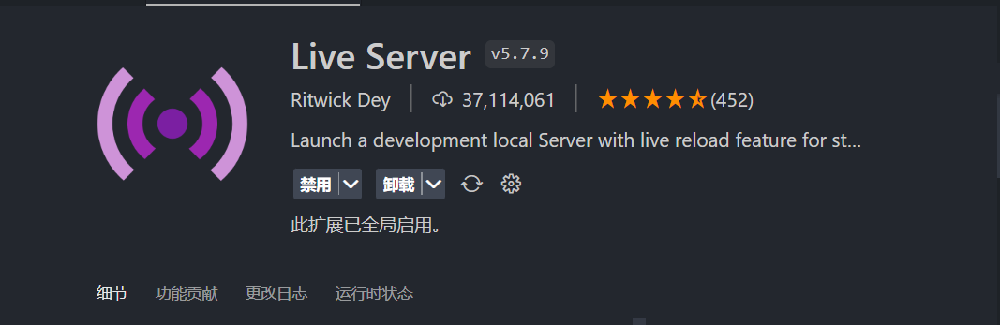

它可以实时地反应网页的变化，安装后在html文件中右键选择`open with live server`即可使用

**注意：要开服务器操作，否则会报跨域问题。**

学习代码：

JSON：

```json
[
    {
        "userId": 1,
        "userName": "Harry James Potter",
        "userSchool": "Gryffindor",
        "userAge": 13
    },
    {
        "userId": 2,
        "userName": "Hermione Jean Granger",
        "userSchool": "Gryffindor",
        "userAge": 14
    },
    {
        "userId": 3,
        "userName": "Ronald Bilius Weasley",
        "userSchool": "Gryffindor",
        "userAge": 13
    },
    {
        "userId": 4,
        "userName": "Percy Ignatius Weasley",
        "userSchool": "Gryffindor",
        "userAge": 17
    },
    {
        "userId": 5,
        "userName": "Remus Lupin",
        "userSchool": "Gryffindor",
        "userAge": 33
    },
    {
        "userId": 6,
        "userName": "Albus Percival Wulfric Brian Dumbledore",
        "userSchool": "Gryffindor",
        "userAge": 112
    }
]
```

TXT:

```plaintext
[
    {
        "userId": 1,
        "userName": "Harry James Potter",
        "userSchool": "Gryffindor",
        "userAge": 13
    },
    {
        "userId": 2,
        "userName": "Hermione Jean Granger",
        "userSchool": "Gryffindor",
        "userAge": 14
    },
    {
        "userId": 3,
        "userName": "Ronald Bilius Weasley",
        "userSchool": "Gryffindor",
        "userAge": 13
    },
    {
        "userId": 4,
        "userName": "Percy Ignatius Weasley",
        "userSchool": "Gryffindor",
        "userAge": 17
    },
    {
        "userId": 5,
        "userName": "Remus Lupin",
        "userSchool": "Gryffindor",
        "userAge": 33
    },
    {
        "userId": 6,
        "userName": "Albus Percival Wulfric Brian Dumbledore",
        "userSchool": "Gryffindor",
        "userAge": 112
    }
]
```


HTML：

```html
<!DOCTYPE html>
<html lang="en">
<head>
    <meta charset="UTF-8">
    <meta name="viewport" content="width=device-width, initial-scale=1.0">
    <!-- JQuery引入 -->
    <script src="../assets/js/code.jquery.com_jquery-3.7.0.js"></script>
    <title>哆哆啦のJQuery学习笔记页面-13</title>
</head>
<body>
    <button id="btn">查询数据</button>
</body>
    <!-- 
        jquery调用Ajax的方法：
            格式：
                $.ajax({});
            参数：
                type            请求方式GET/POST
                url             请求地址url
                async           是否同步，默认是true表示异步
                data            发送到服务器的数据
                dataType        预期服务器返回的数据类型
                contentType     设置请求头
                success         请求成功时调用此函数
                error           请求失败时调用此函数
     -->
    <script>
        // 请求.txt数据
        $.ajax({
            type: "GET", //请求方式
            url: "../assets/source/data.txt",
            data:{  // 请求数据，json对象
                uname: "Hermione Jean Granger"  // 如果没有参数，则不需要设置
            },
            // 请求成功时调用的函数
            success: function (data) {  // 这里的data只是个形参
                console.log(data)   // 字符串 操作结果1
                // 将字符串转换成json对象
                var obj = JSON.parse(data);
                console.log(obj)    // json对象（一个js数组） 操作结果2
                // 这样可以直接使用数组下标去取值操作
            }
        })

        // 请求.json数据
        $.ajax({
            type: "GET", //请求方式
            url: "../assets/source/data.json",
            data: {  // 请求数据，json对象
                // uname: "Hermione Jean Granger"  // 如果没有参数，则不需要设置
            },
            dataType: "json",   // 预期返回的数据类型，如果是json格式，我们接收到返回值时，会自动封装成json对象
            // 请求成功时调用的函数
            success: function (data) {  // 这里的data只是个形参
                console.log(data)   // json对象（是一个js数组） 操作结果3
                // 如果又使用JSON.parse()转换，会报错
                    /* 
                    var obj = JSON.parse(data);
                    console.log(obj)
                    */
                
                // 所以使用dataType来规定后台返回的数据类型

                // Dom操作
                // 创建ul
                var ul = $("<ul></ul>")
                console.log(ul)
                // 遍历返回的数据数组
                for (var i = 0; i < data.length; i++){
                    // 得到数组中的每一个元素
                    var user = data[i]
                    // 创建li元素
                    var li = "<li>"+user.userName+"</li>"
                    // 将li元素设置到ul元素中
                    ul.append(li)
                }
                console.log(ul)
                // 将ul设置到body标签中
                $("body").append(ul)    // 操作结果4
            }
        })

        // 尝试来个点击事件~（点击显示学院）
        // 点击按钮，发送Ajax请求，将数据显示到页面中
        // $("#btn").click(function () { 这里面可以写下面的Ajax请求 })
        $("#btn").click(function () {
            $.ajax({
                type: "GET", //请求方式
                url: "../assets/source/data.json",
                data: {},
                dataType: "json",
                // 请求成功时调用的函数
                success: function (data) {
                    console.log(data)

                    // Dom操作
                    // 创建ul
                    var ul = $("<ul></ul>")
                    console.log(ul)
                    // 遍历返回的数据数组
                    for (var i = 0; i < data.length; i++) {
                        // 得到数组中的每一个元素
                        var user = data[i]
                        // 创建li元素
                        var li = "<li>" + user.userSchool + "</li>"
                        // 将li元素设置到ul元素中
                        ul.append(li)
                    }
                    console.log(ul)
                    // 将ul设置到body标签中
                    $("body").append(ul)    // 操作结果5
                }
            })
        })
    </script>
</html>
```

操作结果1：


操作结果2：


操作结果3：

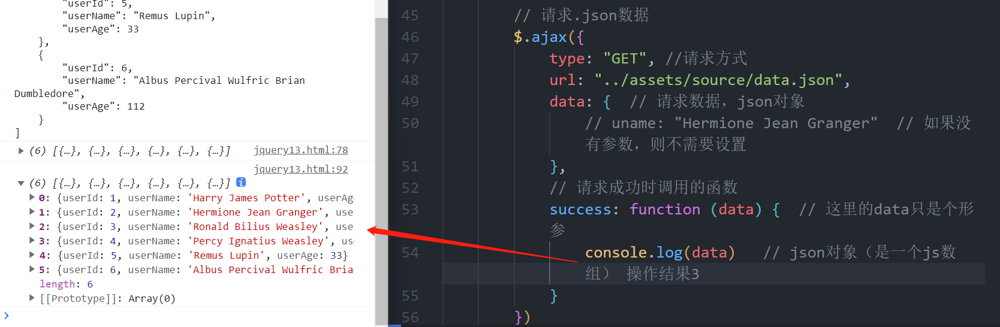

操作结果4：


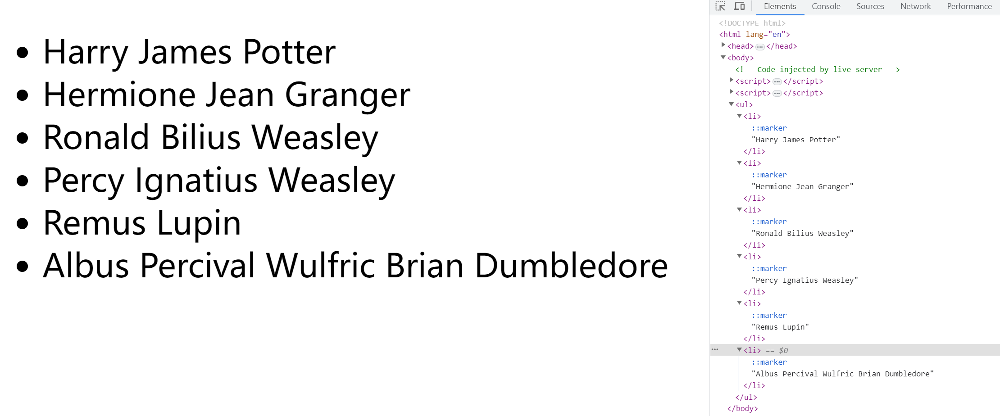

操作结果5：

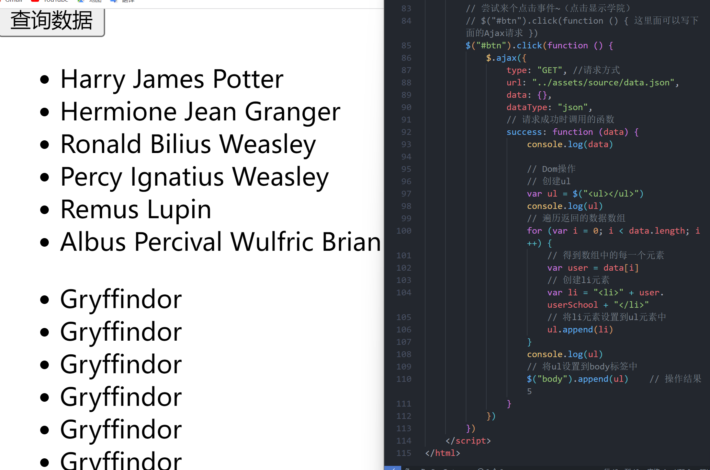

### 5.2 $.get()和$.post()

这是一个简单的GET请求功能以取代复杂的$.ajax()

请求成功时可调用回调函数。如果需要在出错时执行函数，请使用$.ajax()

```js
// 1.请求json文件，忽略返回值
$.get('url')

// 2.请求json文件，传递参数，忽略返回值
$.get('url', {参数名1:参数值1, 参数名2:参数值2})

// 3.请求json文件，拿到返回值，请求成功后可拿到返回值
$.get('url',function(data){
    xxxx
})

// 4.请求json文件，传递参数，拿到返回值
$.get('url',{参数名1:参数值1, 参数名2:参数值2},function(data){
    xxxx
})
```

$.post()和$.get()语法一模一样

```js
// 1.请求json文件，忽略返回值
$.get('url')

// 2.请求json文件，传递参数，忽略返回值
$.get('url', {参数名1:参数值1, 参数名2:参数值2})

// 3.请求json文件，拿到返回值，请求成功后可拿到返回值
$.get('url',function(data){
    xxxx
})

// 4.请求json文件，传递参数，拿到返回值
$.get('url',{参数名1:参数值1, 参数名2:参数值2},function(data){
    xxxx
})
```

学习代码：

```html
<!DOCTYPE html>
<html lang="en">
<head>
    <meta charset="UTF-8">
    <meta name="viewport" content="width=device-width, initial-scale=1.0">
    <!-- JQuery引入 -->
    <script src="../assets/js/code.jquery.com_jquery-3.7.0.js"></script>
    <title>哆哆啦のJQuery学习笔记页面-14/title>
</head>
<body>
    
</body>
    <!-- 
        $.get();
            语法：
                $.get("请求地址","请求参数",function(形参){
                    xxxx
                })
        $.post();
            语法：
                $.post("请求地址","请求参数",function(形参){
                    xxxx
                })
     -->
     <script>
        // $.get()
        $.get("../assets/source/data.json",{},function (data) {
            console.log(data)   // 返回数组，和$.ajax()一样
        })

        // $.post()
        $.post("../assets/source/data.json", {}, function (data) {
            console.log(data)   // 返回数组，和$.ajax()一样
        })
        // 现在没有服务器，所以post请求会是404（Not Found）
     </script>
</html>
```


### 5.3 $.getJSON()

表示请求返回的数据类型是json格式的Ajax请求。

```js
$.getJSON('url',{参数名1:参数值1, 参数名2:参数值2},function(形参){
    xxxx
})
```


学习代码：

```html
<!DOCTYPE html>
<html lang="en">
<head>
    <meta charset="UTF-8">
    <meta name="viewport" content="width=device-width, initial-scale=1.0">
    <!-- JQuery引入 -->
    <script src="../assets/js/code.jquery.com_jquery-3.7.0.js"></script>
    <title>哆哆啦のJQuery学习笔记页面-14/title>
</head>
<body>
    
</body>
    <!-- 
        $.getJSON
            语法：
                $.getJSON("请求地址", "请求参数", function(形参){
                    xxxx
                })
            注：getJSON方式要求返回的数据格式满足json格式（json字符串）
     -->
     <script>
        $.getJSON("../assets/source/data.json",{},function(data){
            console.log(data)
        })
        // 如果返回的数据不是json格式，则无法获取
     </script>
</html>
```

## jQuery自定义函数

[怎样用jQuery自定义函数方法，用$可调用_jquery怎么自定义方法_weixin_43798882的博客-CSDN博客](https://blog.csdn.net/weixin_43798882/article/details/112618241)

