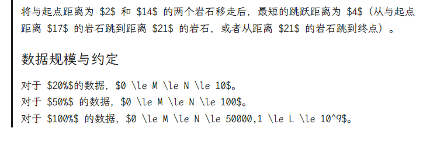

# 【拓展Markdown】为hugo渲染数学公式

### 效果

解决了之前一直没有解决的一个小bug——我的hugo没有办法渲染Markdown里数学公式捏qwq
现在成功从图1到图2了！

|  |
| :---------------------: |
|        调整之前         |
|   |
|        调整之后         |

这里记录一下干了什么吧qwq

数学公式与代码高亮不同，hugo本身不支持渲染数学公式，所以我们在前端新加一个html页面去处理这个渲染问题。

MathJax官方介绍了3中引入mathjax的方法，考虑到我们的页面还需要渲染到行内公式，我们选择全局引入。

官方提供：[Three Ways to Use MathJax in Node — MathJax 3.2 documentation](https://docs.mathjax.org/en/latest/server/overview.html)

### 方法

在`./layouts/partials/`下新建一个`mathjax.html`

在`./layouts/partials/extend_head.html`引入：

```html
{{partial "mathjax.html" .}}
```

在`mathjax.html`写入下方代码：

```html
{{ if .Params.math }}
<script>
  MathJax = {
    tex: {
      inlineMath: [["$", "$"]],
    },
    displayMath: [
      ["$$", "$$"],
      ["\[\[", "\]\]"],
    ],
    svg: {
      fontCache: "global",
    },
  };
</script>
<script src="https://polyfill.io/v3/polyfill.min.js?features=es6"></script>
<script
  id="MathJax-script"
  async
  src="https://cdn.jsdelivr.net/npm/mathjax@3/es5/tex-mml-chtml.js"
></script>
{{ end }}
```

然后在需要显示数学公式的markdown文档中添加如下参数：

```markdown
+++
...
math = true
+++
```


