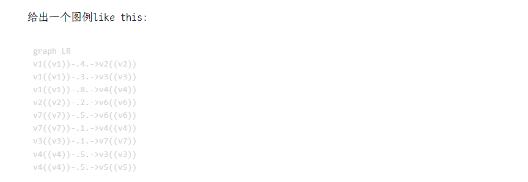
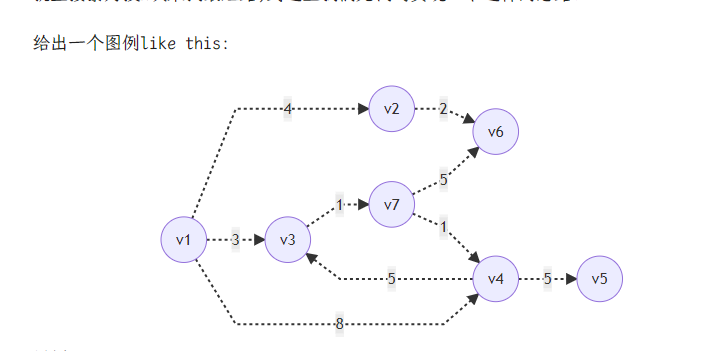

# 【拓展Markdown】为hugo渲染Mermaid绘图

今天打算转帖原来发过的一篇博文时，遇到了Markdown中嵌入的Mermaid无法正常显示的问题，Mermaid可以内嵌于Markdown中通过代码显示svg绘图，但是显然hugo本身不含，这篇记录如何调整hugo达到如下效果转换：

### 效果

|  |
| :---------------------: |
|        调整之前         |
|   |
|        调整之后         |

### 配置方法

这里涉及到hugo中设置代码高亮的配置，我们检查`hugo.toml`

写入/修改：

```toml
[markup.highlight]
    codeFences = true
    guessSyntax = false  # 注意这一项
    # hl_Lines = ""
    lineAnchors = ""
    lineNoStart = 1
    lineNos = true
    lineNumbersInTable = true
    noClasses = false
    style = "monokai"
    tabWidth = 4
```

在`./layouts/partials/`下新建一个`mermaid.html`

写入：

```html
{{ if .Params.mermaid }}
<script
  src="https://cdn.jsdelivr.net/npm/mermaid@8.8.2/dist/mermaid.min.js"
  integrity="sha256-KqisLh8jVMBRjpNkOhH5W9VWs+F6x6vQksLqxs7+x9A="
  crossorigin="anonymous"
></script>
<script>
  // Replace mermaid pre.code to div
  Array.from(document.getElementsByClassName("language-mermaid")).forEach(
    (el) => {
      el.parentElement.outerHTML = `<div class="mermaid">${el.innerText}</div>`;
    }
  );
</script>
<style>
  /* Set svg to center */
  .mermaid svg {
    display: block;
    margin: auto;
  }
</style>
{{ end }}
```

然后在`./layouts/_default/baseof.html`引入：

```html
<body>
    ...
    {{ partial "mermaid.html" .}}
</body>

```


