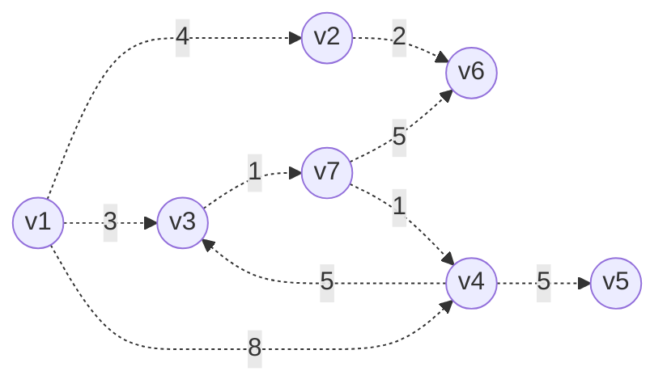
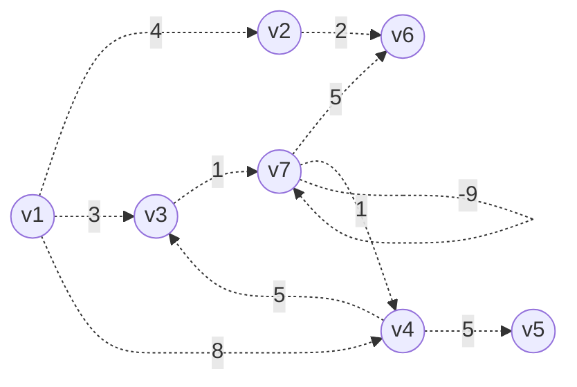

# 最短路问题（Dijkstra + SPFA + Floyd）


### 思维先行

我们要找某点到某点的最短路径(记为点u到点v)，这样的路径只能从两种路径中选择——

1. u和v之间有边连接时，存在边(u, v)，不存在的话可以视作这两点的距离无限大
2. u和v可以通过某些点中转相连，这个(最短的)中转路径

很明显，我们选最短路径肯定是在这两种路径当中选最短的来作为u和v的最短距离，而路径选择2又可以不断拆分，比如我们有`u -> P -> v`我们再去寻找这条路径的最短时，可以分为`u -> P`最短+`P -> v`最短，再去寻找中转点...而且每次取最小值最小的+最小的肯定得最小的（有一点贪心的感觉）。

那么思维布置到这，我们来看看这个寻找最短路径的几种算法：

### Floyd算法&Bellman-Ford算法

* ==Floyd算法==

这个算法就是刚刚思维里的算法的朴素实现了，动态规划思维，不断去尝试增加节点来找最小值。伪代码如下：

```cpp
#define INF 0x3f3f3f3f
dist[maxn][maxn];
// dist[u][v]记录从点u到点v的距离
// 初始化时dist[n][n]=0, 两点有边则记录为w<u, v>，其他的就是INF
void Floyd(int n){
	// 一共有n个点，我们遍历填充dist[][]数组来计算所有的距离
	for(int p=1 ;p <= n;p++){
		// 点p是中转点
		for(int u=1;u<=n;u++){
			for(int v=1;v<=n;v++){
				dist[u][v] = min(dist[u][v], dist[u][p]+dist[p][v]);
			}
		}
	}
}
```

很明显，这个算法有`O(n^3)`的复杂度，并不好，而且开的`dist[maxn][maxn]`数组空间也大，和之前学习存储图时一样，如果图比较稀疏，浪费的空间也大。

如何优化呢？

先看算法上，我们在选择中间点p的时候，我们很容易想到——并不是所有的点1~点n和u都有边，所以假如我们按边存储成为邻接表(前向星/链式前向星)，我们在搜索边的时候就能直接在已有的`<u, p>`边上进行选择。

`TIP`：Floyd算法可以获得所有点之间的最短距离，所以在需要处理多源最短路且数据规模比较小的时候会选择它。

我们更关心**单源最短路**问题，接下来我们的问题就假定为：找到以点v~1~为起点的最短路。

由于是确定起点的单源最短路，我们接下来记录距离的数组只用开一维就行。

初始化：`dist[1]=0, dist[v]=distance[1][v], 其他的置INF`。

在Bellman-Ford算法中，我们假设不存在**负权环**（有负权环我们就会发现每绕一次dist都在变小，而我们取`min（dist[v],weight(p->v)+dist[v]）`肯定会把路径上的这个负权环走超过n遍），那么从v~1~到任何点的路径上点的个数都不会大于总点数n，所以Bellman-Ford算法就直接暴力搜n次来找最短路,到这里我们先代码实现一下这样的思路：

给出一个图例like this：



样例：

```plaintext
7 9
1 2 4
1 3 3
1 4 8
2 6 2
3 7 1
4 3 5
4 5 5
7 6 5
7 4 1

```

参考代码like this：

```cpp
#include<bits/stdc++.h>
using namespace std;
#define INF 0x3f3f3f3f
const long long maxn = 1e5 + 50, maxm = 1e7 + 50;

struct EdgeNode {
	int from;
	int to;		// 终点
	int w;		// 权值
	int next;	// 下一位置
};
EdgeNode Edge[maxm];
int head[maxn];

int dist[maxm];
int n, m;

void BellmanFord(int vn) {
	// 初始化dist[]
	fill(dist + 1, dist + n + 1, INF);
	dist[vn] = 0;

	int turn = n - 1;
	while (turn--)
		// 下方的遍历重复n-1遍，保证可以更新全部的dist[]
		for (int ei = 0;ei < m;ei++)
			dist[Edge[ei].to] = min(dist[Edge[ei].to], dist[Edge[ei].from] + Edge[ei].w);
	// 这里为了方便获得查看的边的起点，可以在储存边的起点的时候加一个from的信息(否则就要先去找起点是谁)
}

int main() {
	cin >> n >> m;

	// 初始化head
	memset(head, -1, sizeof(head));
	
	// 读入数据
	for (int i = 0;i < m;i++) {
		int fi, ti, wi;
		cin >> fi >> ti >> wi;
		Edge[i].to = ti;
		Edge[i].w = wi;
		Edge[i].from = fi;

		Edge[i].next = head[fi];
		head[fi] = i;
	}

	BellmanFord(1);

	for (int i = 1;i <= n;i++)
		cout << dist[i] << " ";
	cout << endl;
	// ->0 4 3 5 10 6 4 

	return 0;
}
```

`IDEA`：我们在这个算法中可以发现，我们选边的时候对于它终点于何处并不关心，相反，我们会关心它的起点的信息（我们要算的源起点到该边的起点的距离），所以直接在存边的时候添加起点(from)的记录会方便我们确定起点。

虽然上文提到我们不考虑负权环的存在，但是我们可以想象，如果存在负权环，该图进入Bellman-Ford算法之后会有神奇的数据产生，我们试试看：

给我们的测试数据添加一个负权边：

```plaintext
7 10
1 2 4
1 3 3
1 4 8
2 6 2
3 7 1
4 3 5
4 5 5
7 7 -9
7 6 5
7 4 1

```



```plaintext
同样的程序跑出来的结果是：
0 4 -35 -49 -35 -45 -50
原来的结果：
0 4 3 5 10 6 4 
```

思考：不管有没有负权环，我们得到的其实都是合理的最短路径，但是存在负权环会使得到某些点的最短距离一定会减少（加上一个负数肯定变小，而我们选择的是较小的那个路径），所以有负权环时，最短路径(假设路径上的点的数量没有限制)其实可以无限短，我们先前用暴力循环所有的点来保证所有的dist数组能够更新到最佳，那么假如有负权环在其中，dist数组没有最佳状态，所以我们简单的多循环一边，假如没有负权环，再多循环一边并不会改变dist数组里的值，如果有负权环，dist数组里一定有值改变。我们试试看：

```plaintext
原来保证得到最佳只需要暴力循环n-1遍，得结果：
0 4 -35 -49 -35 -45 -50
暴力n次的结果：
0 4 -44 -58 -44 -54 -59
```

符合我们的想法。

不过啊这个算法还是有暴力的成分，我们先前提到的只要遍历那些起点可直接到达的点等等想法还没实现，Bellman-Ford算法的时间复杂度有`O(nm)`，我们讨论算法的对于这样的复杂度肯定还是不满意的。

我们再回忆一下整个搜索过程：其实我们关系的只是可以拓展的可能当中最小的是哪个，为了找到最小的那个，我们上面用了搜索全部的边、点的方法。那么我们的目的还是还是：有没有一种可以维护数据结构的方式，让我们更容易找到最小的那个可能？

于是**队列优化**进入思维

### SPFA算法

我们找`u -> p -> v`路径时，p点的选择方法会实际影响我们的复杂度。我们的目的肯定是去更新u可以直接到达的点，而下一次就是p可以直接到达的点...

SPFA算法使用一个队列去记录这些可以直接到达的点(也就是答案可能在的路径上)。

SPFA是如何做到“只更新可能更新的点”的？

1. 只让当前点能到达的点入队
2. 如果一个点已经在队列里，便不重复入队
3. 如果一条边的起点还没被更新，那么它的终点不入队

也就是说：当一个点入队了，代表它还在等待更新，当一个点出队了，那么它一定在当前经过最好的更新了。

会有一个点入队了更新之后再次入队的情况吗？会有这种可能。

来看看代码实现吧：

```cpp
// 因为queue其实没有查找操作，所以简单用个bool型数组记录点p在队列中?inqueue[p]=true:inque[p]=false
bool inqueue[maxn];
void SPFA(int vn) {
	// 寻找vn到各个点的最短路径，记录在dist[]数组中。

	// 初始化dist[]
	fill(dist + 1, dist + n + 1, INF);
	dist[vn] = 0;

	queue<int> updates;
	updates.push(vn);	// 将vn点加入待更新队列

	while (!updates.empty()) {
		// 获得队首点，并把它移除待更新队列
		int firstp = updates.front();
		updates.pop();

		inqueue[firstp] = false;	// 标记firstp已经不在队列中

		for (int k = head[firstp], to = Edge[k].to;k != -1;k = Edge[k].next, to = Edge[k].to) {
			// 遍历k可以直接到达的点to
			if (dist[to] > dist[firstp] + Edge[k].w) {
				dist[to] = dist[firstp] + Edge[k].w;
				if (!inqueue[to]) {
					updates.push(to);
					inqueue[to] = true;
				}
			}
		}
	}
}

```

SPFA算法的时间复杂度并不稳定，可以预想，在极端的情况下，SPFA算法的复杂度可以和Bellman-Ford算法一样是`O(nm)`（不过随机数据模拟的算法复杂度大概是`O(m + nlogn)`）

SPFA算法也可以判断负权环的存在：若一个点入队次数超过n次，接下来无论怎么更新队列都不会为空，可以据此判断是否有负权环。

<del>emmm优化了一点的BellmanFord算法？(思考)</del>

接下来介绍复杂度稳定的贪心算法：==Dijstra算法==

### ☆☆☆Dijstra算法

Dij假设<u>没有负边</u>

因为没有负边，我们可以确定，离起点**最近**的那个顶点的dist一定是那个顶点的最终结果。

思路：起点u可以<u>直接到达</u>的点中，最近的点p对应的e<u, p>一定是dist[p]的最佳值。假如它已经是最佳值了，我们在后面就可以把它当做起点u一样的点。由此我们只需要不断取出待更新队列里dist最小的点，并向后更新一层，直到没有需要再更新的点为止。

```cpp
#include<bits/stdc++.h>
using namespace std;
#define INF 0x3f3f3f3f
const long long maxn = 1e5 + 50, maxm = 1e7 + 50;

struct EdgeNode {
	int from;
	int to;		// 终点
	int w;		// 权值
	int next;	// 下一位置
};
EdgeNode Edge[maxm];
int head[maxn];

int dist[maxm];
int n, m;
int path[maxm];	// 储存路径(存边)
struct Polar {
	// 注意每个dist其实是一对一的绑定了它的索引的，直接写什么return dist[a]>dist[b]会破坏堆的结构，可能会让dist[a]和dist[b]的索引变化。
	int id, dist;

	Polar(int dist, int id) :dist(dist), id(id) {}
	// 对结构体中传数据，和下面这种写法作用一样：
	// Polar(int d, int d_id) {
	// 	dist = d;
	// 	id = d_id;
	// }
	// 重载运算符<
	bool operator<(const Polar& P)const {
		return dist < P.dist;
	}
};
struct cmp {
	// // 重写仿函数法：
	bool operator ()(Polar a, Polar b) {
		// 重载()运算符，使其成为一个仿函数
		return a.dist > b.dist;	
	}
};
// priority_queue<Polar, vector<Polar>, cmp> q;
priority_queue<Polar> q;
bool visited[maxn];
void Dij(int vn) {
	fill(dist + 1, dist + n + 1, INF);
	dist[vn] = 0;
	
	q.push(Polar(0, vn));
	while (!q.empty()) {
		int pid = q.top().id;
		q.pop();
		if (visited[pid]) 
			// 若已经在队列中
			continue;
		
		visited[pid] = true;
		for (int ei = head[pid], to = Edge[ei].to;ei != -1;ei = Edge[ei].next, to = Edge[ei].to) {
			if (dist[pid] + Edge[ei].w < dist[to]){
				dist[to] = dist[pid] + Edge[ei].w;
				path[to] = Edge[ei].from;	// 记录路径的
               	if (!visited[to])
				q.push(Polar(dist[to], to));
			}
			
		}
	}
}

int main() {
	cin >> n >> m;

	// 初始化head
	memset(head, -1, sizeof(head));
    
	// 读入数据
	for (int i = 0;i < m;i++) {
		int fi, ti, wi;
		cin >> fi >> ti >> wi;
		Edge[i].to = ti;
		Edge[i].w = wi;
		Edge[i].from = fi;

		Edge[i].next = head[fi];
		head[fi] = i;
	}

	int s = 1, t = 5;
	Dij(s);

	for (int i = 1;i <= n;i++)
		cout << dist[i] << " ";
	cout << endl;
	// ->0 4 3 5 10 6 4

	while (t != s) {
		cout << t << "<-";
		t = path[t];
	}
	cout << t;
    // ->5<-4<-7<-3<-1

	return 0;
}
```

当然了用pair也行，反正只有id和dist两个数据，<del>多个其实也没关系你也可以pair套pair</del>

(另外两种简单的写法在STL.md里面写了，这里不写了)

#### -如何记录路径？

把在更新点更新path数组就行。也就是dist[pos]>dist[u]+w(u->pos)的时候把这个更新的来源放在path数组里就行（记录到达某点的最好的路径的上一个来源点）。像这样：

```cpp
if (dist[pid] + Edge[ei].w < dist[to]){
    dist[to] = dist[pid] + Edge[ei].w;
    path[to] = Edge[ei].from;
}
```

### 模板题

> 模板题指路：
>
> [P3371 【模板】单源最短路径（弱化版） - 洛谷 | 计算机科学教育新生态 (luogu.com.cn)](https://www.luogu.com.cn/problem/P3371)
>
> [P4779 【模板】单源最短路径（标准版） - 洛谷 | 计算机科学教育新生态 (luogu.com.cn)](https://www.luogu.com.cn/problem/P4779)
>
> P3371【模板】单源最短路径（弱化版）
>
> ==题目背景==
>
> 本题测试数据为随机数据，在考试中可能会出现构造数据让SPFA不通过，如有需要请移步 [P4779](https://www.luogu.org/problemnew/show/P4779)。
>
> 题目描述
>
> 如题，给出一个有向图，请输出从某一点出发到所有点的最短路径长度。
>
> ==输入格式==
>
> 第一行包含三个整数 $n,m,s$，分别表示点的个数、有向边的个数、出发点的编号。
>
> 接下来 $m$ 行每行包含三个整数 $u,v,w$，表示一条 $u \to v$ 的，长度为 $w$ 的边。
>
> ==输出格式==
>
> 输出一行 $n$ 个整数，第 $i$ 个表示 $s$ 到第 $i$ 个点的最短路径，若不能到达则输出 $2^{31}-1$。
>
> ==样例==
>
> 样例输入 #1
>
> ```plaintext
> 4 6 1
> 1 2 2
> 2 3 2
> 2 4 1
> 1 3 5
> 3 4 3
> 1 4 4
> ```
>
> 样例输出 #1
>
> ```plaintext
> 0 2 4 3
> ```
>
> ==提示==
>
> 【数据范围】    
> 对于 $20\%$ 的数据：$1\le n \le 5$，$1\le m \le 15$；  
> 对于 $40\%$ 的数据：$1\le n \le 100$，$1\le m \le 10^4$；   
> 对于 $70\%$ 的数据：$1\le n \le 1000$，$1\le m \le 10^5$；   
> 对于 $100\%$ 的数据：$1 \le n \le 10^4$，$1\le m \le 5\times 10^5$，$1\le u,v\le n$，$w\ge 0$，$\sum w< 2^{31}$，保证数据随机。
>
> **Update 2022/07/29：两个点之间可能有多条边，敬请注意。**
>
> 对于真正 $100\%$ 的数据，请移步 [P4779](https://www.luogu.org/problemnew/show/P4779)。请注意，该题与本题数据范围略有不同。
>
>
> 样例说明：
>
> 
>
> 图片1到3和1到4的文字位置调换

AC代码

```cpp
#include<bits/stdc++.h>
using namespace std;
#define INF 0x3f3f3f3f
const long long maxn = 1e5 + 50, maxm = 1e7 + 50;
typedef long long ll;
struct EdgeNode {
	int from;
	int to;		// 终点
	ll w;		// 权值
	int next;	// 下一位置
};
EdgeNode Edge[maxm];
int head[maxn];

ll dist[maxm];
ll n, m;
bool inqueue[maxn];
void SPFA(int vn) {
	fill(dist + 1, dist + n + 1, INF);
	dist[vn] = 0;

	queue<int> updates;
	updates.push(vn);
	while (!updates.empty()) {
		int firstp = updates.front();
		updates.pop();

		inqueue[firstp] = false;

		for (int k = head[firstp], to = Edge[k].to;k != -1;k = Edge[k].next, to = Edge[k].to) {
			// 遍历k可以直接到达的点to
			if (dist[to] > dist[firstp] + Edge[k].w) {
				dist[to] = dist[firstp] + Edge[k].w;
				if (!inqueue[to]) {
					updates.push(to);
					inqueue[to] = true;
				}
			}
		}
	}
}


int main() {
	int s;
	cin >> n >> m >> s;

	// 初始化head
	memset(head, -1, sizeof(head));
	
	// 读入数据
	for (int i = 0;i < m;i++) {
		ll fi, ti, wi;
		cin >> fi >> ti >> wi;
		Edge[i].to = ti;
		Edge[i].w = wi;
		Edge[i].from = fi;

		Edge[i].next = head[fi];
		head[fi] = i;
	}

	SPFA(s);

	for (int i = 1;i <= n;i++)
		cout << dist[i] << " ";

	return 0;
}
```

这个...没有卡SPFA。看另一个卡SPFA的题：

> P4779【模板】单源最短路径（标准版）
>
> ==题目背景==
>
> 2018 年 7 月 19 日，某位同学在 [NOI Day 1 T1 归程](https://www.luogu.org/problemnew/show/P4768) 一题里非常熟练地使用了一个广为人知的算法求最短路。
>
> 然后呢？
>
> $100 \rightarrow 60$；
>
> $\text{Ag} \rightarrow \text{Cu}$；
>
> 最终，他因此没能与理想的大学达成契约。
>
> 小 F 衷心祝愿大家不再重蹈覆辙。
>
> ==题目描述==
>
> 给定一个 $n$ 个点，$m$ 条有向边的带非负权图，请你计算从 $s$ 出发，到每个点的距离。
>
> 数据保证你能从 $s$ 出发到任意点。
>
> ==输入格式==
>
> 第一行为三个正整数 $n, m, s$。
> 第二行起 $m$ 行，每行三个非负整数 $u_i, v_i, w_i$，表示从 $u_i$ 到 $v_i$ 有一条权值为 $w_i$ 的有向边。
>
> ==输出格式==
>
> 输出一行 $n$ 个空格分隔的非负整数，表示 $s$ 到每个点的距离。
>
> ==样例==
>
> 样例输入 #1
>
> ```plaintext
> 4 6 1
> 1 2 2
> 2 3 2
> 2 4 1
> 1 3 5
> 3 4 3
> 1 4 4
> ```
>
> 样例输出 #1
>
> ```plaintext
> 0 2 4 3
> ```
>
> ==提示==
>
> 样例解释请参考 [数据随机的模板题](https://www.luogu.org/problemnew/show/P3371)。
>
> $1 \leq n \leq 10^5$；
>
> $1 \leq m \leq 2\times 10^5$；
>
> $s = 1$；
>
> $1 \leq u_i, v_i\leq n$；
>
> $0 \leq w_i \leq 10 ^ 9$,
>
> $0 \leq \sum w_i \leq 10 ^ 9$。
>
> 本题数据可能会持续更新，但不会重测，望周知。
>
> 2018.09.04 数据更新 from @zzq

AC代码

```cpp
#include<bits/stdc++.h>
using namespace std;
#define INF 0x3f3f3f3f
typedef long long ll;
const long long maxn = 1e5 + 50, maxm = 1e7 + 50;

struct EdgeNode {
	int from;
	int to;		// 终点
	int w;		// 权值
	int next;	// 下一位置
};
EdgeNode Edge[maxm];
int head[maxn];

int dist[maxm];
int n, m;
// priority_queue<pair<ll, int>> q;
priority_queue<pair<ll, int>, vector<pair<ll, int>>, greater<pair<ll, int>>> q;
bool visited[maxn];	// 记录已经获得最短路的点

void Dij(int vn) {
	dist[vn] = 0;
	// 初始化
	q.push(make_pair(dist[vn], vn));
	while (!q.empty()) {
		// 取队首元素(最小的)将它移出队列并标记移出
		int pid = q.top().second;
		q.pop();
		if (visited[pid])
			continue;
		visited[pid] = true;
		for (int ei = head[pid], to = Edge[ei].to;ei != -1;ei = Edge[ei].next, to = Edge[ei].to) {
			// 找和pid(被移出的已最佳点)相连的边，更新dist
			if (dist[to] > dist[pid] + Edge[ei].w) {
				dist[to] = dist[pid] + Edge[ei].w;
				if (!visited[to])
					q.push(make_pair(dist[to], to));
			}
		}
	}
}

int main() {
	int s;
	cin >> n >> m >> s;

	// 初始化head
	memset(head, -1, sizeof(head));
    
	// 读入数据
	for (int i = 0;i < m;i++) {
		int fi, ti, wi;
		cin >> fi >> ti >> wi;
		Edge[i].to = ti;
		Edge[i].w = wi;
		Edge[i].from = fi;

		Edge[i].next = head[fi];
		head[fi] = i;
	}

	fill(dist + 1, dist + n + 1, INF);
	Dij(s);

	for (int i = 1;i <= n;i++)
		cout << dist[i] << " ";
	cout << endl;

	return 0;
}
```

<del>啊总算绕完最短路这几个算法了，时候想通了感觉还挺明白的，不过由于某人的码力好差，老是达不到想要的效果[可恶]，还得多写代码而不是只注重想法。写出来了才算是初步会了！</del>

